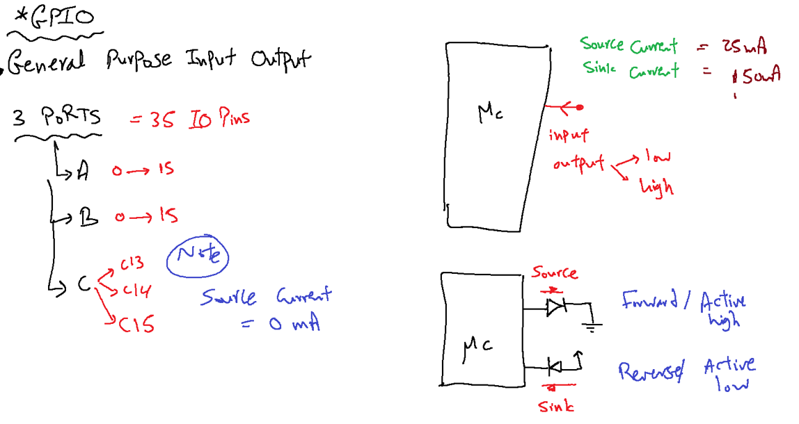

# ARM-M4
## This repo related to ARM M4 course preparation   


## CH0-History of ARM:
### The Beginning:<br /> 
## ⚡Acorn Computers Ltd <br />
Founded at **1980’s**.<br /> 
the reasoning behind the naming of Acorn was to be ahead of Apple computers in the telephone directory!<br />  Fast forward a few years they produce the BBC Micro, a government initiative to put a computer in every classroom in Britain with a little task of coming up with the microprocessor design for Acorn’s own 32 bit processor with little to no resources therefore the design had to be good and simple **Arm1**
<br />Development on the Acorn RISC Machine didn't start until some time around late **1983** or early **1984**<br />
**26th April 1985** **Arm2**<br />
 Acorn Archimedes which was released in 1987, was the first RISC based home computer<br />
 **1990 as Advanced RISC Machines Ltd**<br />
 tructured as a joint venture between Acorn Computers, Apple Computer (now Apple Inc.) and VLSI Technology. The reason for this was because Apple wanted to use Arm technology but didn’t want to base a product on Acorn IP – who, at the time were considered a competitor. Apple invested the cash, VLSI Technology provided the tools, and Acorn provided the **12 engineers** and with that Arm was born, and its luxury office in Cambridge – A barn!<br />
 <p align="center">
    
</p>

  **They created**  <br />
 Cambridge Processor Unit or CPU
 in 1993 the Apple Newton was launched on Arm architecture.
t wasn't the best piece of technology, as unfortunately Apple over reached for the technology that was available for them at the time - the Newton has flaws which lowered its usability vastly. Due to these factors Arm realized they could not sustain success on single products<br />

## ARM Supply processor architecture
 The Arm processor was licensed to many semiconductor companies for an upfront license fee and then royalties on production silicon. This made Arm a partner to all these companies, effectively trying to speed up their time to market as it benefited both Arm and its partners. For me personally

## TI, Arm7, and Nokia
The crucial break for Arm came in 1993 with Texas Instruments (TI). This was the breakthrough design that gave Arm credibility and proved the successful viability of the company’s novel licensing business model. The deal drove Arm to formalize their licensing business model and also drove them to make more cost-effective products. Such deals with Samsung and Sharp proved networking within the industry was crucial in infecting enthusiastic support for Arm’s products and in gaining new licensing deals. These licensing deals also led to new opportunities for the development of the RISC architecture. Arm’s relatively small size and dynamic culture gave it a response-time advantage in product development. Arm’s hard work came to fruition in 1994, during the mobile revolution when realistic small mobile devices were a reality. The stars aligned and Arm was in the right place at the right time. Nokia were advised to use Arm based system design from TI for their upcoming GSM mobile phone. Due to memory concerns Nokia were against using Arm because of overall system cost to produce. This led to Arm creating a custom 16 bit per instruction set that lowered the memory demands, and this was the design that was licensed by TI and sold to Nokia. The first Arm powered GSM phone was the Nokia6110 and this was a massive success. The Arm7 became the flagship mobile design for Arm and has since been used by over 165 licensees and has produced over **10 Billion chips since 1994.**
<p align="center">
  
    
</p>

## Going Public
By the end of 1997, Arm had grown to become a £26.6m private business with £2.9m net income and the time had come to float the company. Although the company had been preparing to float for three years, the tech sector was in a bubble at the time and everyone involved was very apprehensive, but felt it was the right move for the company to capitalize on the massive investment in the tech sector of the time.

On April 17th, 1998, Arm Holdings PLC completed a joint listing on the London Stock Exchange and NASDAQ with an IPO at £5.75. The reason for the joint listing was twofold. First, NASDAQ was the market through which Arm believed it would gain the sort of valuation it deserved in the tech bubble of the time which was mainly based out of the states. Second, the two major shareholders of Arm were American and English, and Arm wished to allow existing Acorn shareholders in the UK to have continued involvement. Arm going public caused the stock to soar and turned the small British semiconductor design company into a Billion Dollar company in a matter of months!
<p align="center">
  
</p>

## reference
https://community.arm.com/arm-community-blogs/b/architectures-and-processors-blog/posts/a-brief-history-of-arm-part-1
___
## ARM categories    

**ARM divided into 3 main categories** <br />
Cortex -A : [Application]For graphics and rich OS<br />
Cortex -R : [Response]For high response systems like antena <br />
Cortex -M :[Medium]For embedded applications <br />
**ARM categories performance**<br />


**ARM partners**<br />


**ARM Major characteristics**<br />
| High performance | Low cost | Low power <br />
|Enhanced determinisim | Ease of use | wide choices <br />

# ATmega32 VS stm32
| Comparassion    | ATmega32        |  STM 32F103C8T6 |
| :------------   |:---------------:| -----:          |
| Processor       | 8bit            | 32 bit          |
| Frequancy       | 16mhz           | 72mhz           |
| Flash           | 32K             | 64k             |
| RAM             | 2K              | 20k             |
| I/O             | 32Pin           | 35Pin           |
| Timers          | 3               |  9              |
| ADC             | 8 Channels      |  10             |
| USART           | 1               |  3              | 
| SPI             | 1               |  2              |
| I2C             | 1               |  2              |
| DMA             | N/A             |  1              |
| CAN             | N/A             |  1              |
| RTC             | N/A             |  1              |
| Power           | 5v              |  3.3v           |
 <br />
# How processor work
code is converted into machine language and stored in memory processor contains unit called control unit which contain fetching circuit to get instruction into processor then another circuit called instruction decoder satart to understand the fetched instruction, To understand instruction instruction decoder need two main informations OP code of each instruction for example ADD -->101 the second info is instruction format which divide instruction into three main parts OP code, operand1 and operand2 Another circuit is needed which is called ALU to perform opcode in selection signal to excuite opcode in operand1 and operand2 

**Register bank**
A set of registers in processor (small RAM) each location has special functionality for example 
01-PC program counter to track instructions in memory <br />
02-IR instruction register to store fetched instruction  <br />
03-ACC Acumulator which contains result from ALU <br />
04-PSW Processor status word which contains a set of flags(bits) for example overflow flag, negative flag[1111111]=255 or -1 this flag define negative one or 255, Zerro flag  <br />
05-GPR General purpose registers for fast accessing 
## Hints Dont forget to add some pictures for <br >01- beaglbone<br > 02- Intell galilio <br >03- Ti <br >
# What is new in ARM processor
ARM contains core prepherials exists in the processor <br >
01- NVIC      Nested vector interrupt controller<br >
02- SYSTIC    Timer inside the processor 24 bit <br >
03- MPU       Memory protection unit<br > 
04- ICD       in circuit debugger<br >
### Data buses <br >
01- Address bus<br > Bus neededd to address specific address
02- Data bus<br > Bus needed to transmit or receive data
03- Controll<br > bus Bus needed to send controll commands 
Bus set is a set of data, controll and address buses 
### Harvard Vs Vonnumen architecture
***Harvard is complex !***
Harvard has different asembly instructions for accessing specific bus set
if code in c then the diffult access is RAM bus set  
### Pipeliming concept 
in Harverd architecture there is different bus set for proividing excution of more than one instruction cycle at same time 

ARM Mix between harvard and von-numen
## Questions 
What is the difference between instruction cycle , clock cycle and machie cycle <br >
Clock cycle it generated from clock in hz<br >
Machine cycle the actual clock after prescaller<br >
instruction cycle number for cycle for fetching decoding and excuiting the instruction<br >
[Note]  
16/32 bit instruction is called thumb2 
insurction can be fetched in morethan one cycle for ASK ?

## ToDo
Cemsis<br >
Eclipse debugging <br >
Outlines <br >
## Lec2
***processor*** <br >
Each proecessor Control unit contains a fetching circuit for fetching the instruction and understand it using instruction format and instruction set to decode the instruction then the decoded instruction is enter to ALU to be excuited for op1,op2 and opcode which will be in the selector and then the result will bw in the accumulator <br >
***Memory*** <br >
Development time : Time of development 
Building time    : Time of building the code to get hex 
profiling        : getting memory size needed for uploading the code
Flashing         : Time of burning or flashing the code using flasher or programmer 
The code is represented in the memory using electrical signal on or off zero or one 
Memory can be implemented using:<br >
01- Capacitor  : Charged then one represented in the memory <br >
02- Transistor : Saturation mode "short circuit" which represent 1 
Open circuit mode "represent zero"

|Comparassion       |Transistor           | Capacitor      |
|----------|------------------------------|----------------|
|  Performande         |High                              |Low            |
|  Cost        |High                              |Low                |
|  Size        |Low                              |High                |
|  Power Consum.        |Low                              |High                |
|  Name.        |SRAM                              |DRAM                |

Cpacitor consume a high power because  a refreshment circuit is needed to save charge 
Note: Both DRAM And SRAM are volatile and will not save code text in the flash memory so a 
<br >***floating gate mosfet is needed***<br >
floating gate mosfet is non volatile 
01-Control gate: which receive the signal to be applied on the mosfet and need to be high power to penetrate isolator<br >
02-Isolator     : Exist between control gate and floating gate<br > 
03-Floating gate: a gate which hold the signal between source and drain<br> 
04-Source: like collector of transisor<br >
05-Drain : like transistor collector <br >
if ther a charge stored in the floating gate then Retention time will be 50 years and then it will lose it's charge 
Float gate mosfet may be:<br >
 01-charged then applied signal to gate is zerro
 <br >02-Not charged then applied signal to gate is 1
<br >Note : when the memory is cleared then it will contains ones 
Disadvantages of floating gate mosfet:
01- Nonvolatile    : Which read only for processor and processor can't write over it 
02- Need High powr : to break floating gate mosfet 
### Memories based on float gate mosfet:
***Masked ROM:***
A memory which come already programed and we can't programe it 
<br >***OTP ROM:***
A memory which can be programed only once by the user  
<br >***EPROM:***
Erasable programable ROM can be programed using burner by electricity and can be erased by ultravilot `Widdly used in weapons manufacturing `
<br >***EEPROM:***
Electricall ersable programble can be programed and erased using electricity
<br >***Flash:***
Electricall ersable programble can be programed and erased using electricity

|Comparassion       |EEPROM           | FLASH      |
|----------|------------------------------|----------------|
|  Accessing[write/erasing]         |Byte access                              |Block access            |
|  Cost        |High[need more transistors to access byte]                             |Low                |
|  Endurance        |100,000 write erase                             |10,000                |


[Note]
To undertand relation between flash and EEPROM <br >
Flash access time for example take   10us <br >
EEPROM access time for example take   1us <br >
Case1: Write one byte ``EEPROM`` Will consume 1us and ``Flash`` will consume 10 us which means EEPROM is faster for byte access 
<br >Case2: Write 100 bytes ``EEPROM`` Will consume 100us and ``Flash`` will consume 10 us which means flash is faster for block access<br >

***conclusion:***<br >
Memory divided into two main types <br >
01-Volatile     : [RAM(SRAM-DRAM)]<br >
02-Non-Volatile : [ROM(MASKED-OTP-EPROM-EEPROM-FLASH)]<br >

## Micro controller architecture 
processor contains bus set and flash also contains a bus set which allows processr to be able to access flash one of buses in the bus set is the data bus wich able to connect to a ***specific locations with a specific word size or location width*** so each processor contains memory size to be able to connect a specic size of memory based on address bus and processor contains a specific word size to be able to implement [fetch-decode-excuite]cycles on it 

## Harvard Vs Vonnumnen 

## ARM Architecture 
Arm is internally harvard architecture which appear as vonnumen have single bus set And contains three main bus set<br >
01- IBUS :Instruction Bus -->|------------ |              
02- DBUS :Data Bus-------->|   Bus Matrix   | ------>single Bus set      <br >
03- SBus :System Bus ------>|------------ |          <br >

Bus matrix convert addresses by adding offsets to the address nedded by the processor when one of the BUS set is need to communicate with other memories of RAM, Flash and IO Memory 
## Lec3
ARM Set a protocol to the vendor to follow through manufacturing 
the protocol is called **AMBA** Advanced microcontroller architecture AMBA contains a set of protocols which can be followed by the vendor, The main two protocols in AMBA are <br >
01- AHB Advanced High Performance bus 
      - High Power<br >
      - Complex design wiring  <br >
      - Multi master "More than one prepherial can start communication"
      - Full douplex<br >

02- APB Advanced Peripheral bus<br >
      - Low Power<br >
      - less complexity<br >
      - Low performance <br >

The bus set which out of bus matrix is AHB advanced high performance bus
the peripherials made by vendor will be coonnected to this AHB protocol for example RCC <br >
there is a bridge which is used to convert from AHB to APB as shown 
<p align="center">
  
</p>
Note in the above picture all not in red colour is designed by ARM 
if all prepherials are connected to AHBspeed[72Mhz] it will consume a high power so connect to more lower power protocol APB2 is higher speed[72Mhz] than APB1[36Mhz]

# Steps of programming the chip :
01- Know about needed documents to read from 
02- Know prepherial Bus[AHP-APB] from ST document 
## The Documments 
***ARM*** : Programming manual if you need to get information about coreprepheral<br >
***ST***  : Register description for getting information about vendor prepherial <br >

To know the bus which the prepherial will be connected to open st document "Register description" to get the conected bus 
## AHP Bus connected prepherials 
Note Boundery address is the register reserved addresses 
<p align="center">
  
</p>
APB2 
<p align="center">
   
</p>
APB1
<p align="center">
   
</p>

--------------------------------------------------------------------
## Software development cycle 
<p align="center">
   
</p>

01-***RFQ***:At starting of the project business analyst responsible communicate with the customer to make RFQ `Request for qutation`Document which based on defining cost and time of the project <br >
02-***CRS***:Customer requirement specification detailed technical requirement in the SW which developed by the technical team which converted RFQ into CRS 
The Requirements may be done by `system engineer` who define that  <br >
HSI : Hardware software interface to define hardware requirement document which is hardware team responsibility  <br >
SRS : Software requirement specification document which is sw team responsibility  <br >
03-`System ARchitect`: a person who responsible for making static architecture and dynamic architecture to produce HLD Document `High level design document`<br > 
<p align="center">
   
</p>

***Static Architecture*** : define system software component in layerd model or layerd diagram which named as  [sw component = sw module =sw driver] and consist of:<br >
01-MCAL : contains in controller prepherial : DIO,ADC,UART.....[FirmaWare Engineer responsibility]<br >
02-HAL  : Hardware abstraction layer [FirmaWare Engineer responsibility]:Motor,TFT,WIFI...........<br >
03-APP  : Main which contain the system sequences [Application Engineer responsibility]<br >
Note : any component can call a component from the layers which is down 
one of the common component in the static architecture is the Lib which is called by the other layer and can no't call any layer for example `stdTypes`<br >
Static architecture contains a tables of function names, Arguments and return values <br >
***dynamic Architecture*** :contains all informations related to [Excution time of each function - function ram consumption - ROM consumption `flash` ]<br >
04-`Designer` design a diagram for each function using UML language which descripe how it will work according to system architect requirements as memory and excution time  [Flow chart "Activity diagram", State machine, state chart , sequance diagram] the designer responsible for making ***CDD*** document or each software component <br >
<p align="center">
   
</p>

05-`Developer` responsible for 
DDD :detailed design document which is an optional step as psoducode for the system  and made by developer <br >
06-unit testing : for each function  `by developer`<br >
07-Component testing : each swc alone testing  `tester`  <br >
09-integration testing : integration of all software components `tester` responsibility<br >
10-Validation testing  : Upploading the sw on the board and done by `validator`  <br >
Other supporting positions in the development : Quality assuarance and tooling 

# Q&A
ARM IS HYPERD :actually arm is Harvard but it is working as vonnument because of bus matrix  <br >
01-What advantages of core prepherials : fast access and reusability incase of dealing with the same core such as  stM4 like  TIVA M4 software <br >
02-what is cash memory : sram exists in the processor and faster than external ram and slower than GPR <br >

------------------------
Files in c .h and .c : .c is compiled file and .h is included inside .c file 
Note file Guard is very important to avoid calling more than one file at the same time 
<p align="center">
   
</p>

### Clock system :
is a periodic pulses to organise fetch microcycle, decode microcycle and excuite microcycle cycle 
main types of clock may be </p>
01- Electrical </p>
02- Mechanical </p>
        -Ceramic `Oscilator`</p>
        -Crystal `Resenator`</p>
Note settling time is the time needed to reach steady state 
<p align="center">
   
</p>

# Lec4

ARm is Harvard Architecture but act as vonnumen becuase of bus matrix
The main step to deal with any prepherial is to know the the bus which will be connected to to know it's clock frequency will be suitable or not<br >
***RCC*** :Reset and clock controll responsible for controller reset and adjust system clock, this prepherial is vendor prepherial made by ST to controll arm processor clock <BR >
`Processor Bus matrix, AHP, APP and bridges are made by ARM `
<p align="center">
   
</p>

RCC CAN supply three types of clocks and connected bypass through xtal1 pin and xtal2 not connected <br >
HSI : High speed interanal "Interanl clock" of RC type provide 8Mhz 

HSE : High speed external "External connected clock" may be RC or Crystal type `4-16 Mhz incase of Crystal` type and up to `25 Mhz incase of RC`

PLL : Phase locked loop to amplify the clock <span style="color: green"> can work with internal clock to amplify it, PLL internal clock is RC</span>

Note: Processor able to work with 72 Mhz but from PLL<br >
Rcc provide processor clock selection  

<p align="center">
   
</p>

RCC : Responsible for Enabling and disabling clock which will be passed to the controller 
Q: Does prepherial consume power incase of enable bit is off answer is Yes 
<br > Because there is a circuit which is called `enable check circuit` check if prepherial enable pin is active or not, we can disable enable check circuit by switching off the clock using RCC 
  
So rcc can be use used to enable prepherial clock and select clock value 
<br >

Elements which have clock by default are :<br >
01 - RCC <br >
02 - Core prepherial 
<p align="center">
   
</p>

<span style="color: red"> [NOTE] : There is a memory buffer register responsible for data instruction to fetch data  </span>
<span style="color: green"><br> Crystal connected to micro controller XTAL1 and XTAL2 where RCC is connected to external vcc ...? <br>Becuase RCC need stable dc without ribbles and microcontroller output dc not sharp dc   </span><br>
<span style="color: red">  How pll works internally...?  </span>


## Writing of a driver 
- prepare files 
- Prepare inclusions 
- define registers <br >


drive have a naming convensions where `XYZ` is driver prepheral name<be >
Driver consists of main two sections <br >
01- Fixed : Un touchable 
02- Configurable `able to use driver options according to the implemented configuration` 
<p align="center">
   
</p> <br >

### Rules to include in .c file 
01 - Lib <br >
02 - Interface file of lower layers <br >
03 - Own driver file `Interface - private - config `

----------
ST has 3 production lines 
   - Low denisty 
   - Medium denisty 
   - High denisty
   - Conectivity line <br >
We are intersted in medium denisty 
---------------
To be able to program RC prepherial open Register description document which relevant to the vendor <br >
AS shown from section 7.3.1 to 7.3.10 exists the description of RCC 
   <p align="center">
   
</p> <br >
section 7.3.11 contains register map<br >

- Each prepherial contains base address which is the first address in this prepherial  <br >
- Each register has it's offset from the base address 
- Address of any register = Base address + offset 
<p align="center">
   
</p> <br >
where to get base address from ...? <br >
As shown here from memory map section we can go to the relevant bus which the prepherial will be connected to and then we will find prepherial name and it's base address as shown [0x4002 1000 - 0x4002 13FF]

<br >

<p align="center">
   
</p> <br >

------------------
```
Writting the registers to the code `casting`
0x40021000 = 4 ;    /* is wrong and will produce Lvalue error 
                     its needed to be casted */
#define RCC_CR               *((u32*)0x40021000)
RCC_CR = 4    ;     
```
```
/****************Choseing CLK in processor******/
#define RCC_CR             *((u32*)0x40021000)
#define RCC_CFGR           *((u32*)0x40021004)
/***********************************************/
#define RCC_CIR            *((u32*)0x40021008)
#define RCC_APB2RSTR       *((u32*)0x4002100C)
#define RCC_APB1RSTR       *((u32*)0x40021010)
/***************Enable and Disable CLK***********/
#define RCC_AHBENR         *((u32*)0x40021014)   
#define RCC_APB2ENR        *((u32*)0x40021018)
#define RCC_APB1ENR        *((u32*)0x4002101C)
/***********************************************/
#define RCC_BDCR           *((u32*)0x40021020)
#define RCC_CSR            *((u32*)0x40021024)
#define RCC_CR             *((u32*)0x40021028)
```
## RCC_CR
This register responsible for enabling and disabling of :<br >
01 - HSI<br >
02 - HSE<br >
03 - PLL<br >
Clock security system`CSS`
Responsible for activation of internal clok incase of external clk faliour<br > 
0 : Not Enable <BR> 
1 : Disabled 
HSITRIM[4:0] :
Responsible for trimming `correction by increasing or decreasing of clock by binary digit 40khz`
default 1 0 0 0 0 <BR> 
HSICAL[7:0] :Responsible for reading current existing clock which reached to the system to be corrected by HSITRIM the value is updated only once 

EX: HSICAL Measured 8Mhz+250khz HOW TO get 8Mhz CLK ...?<br>
HSITRIM = 01010   = 8mhz+10k
<p align="center">
   
</p> <br >

## RCC_CFGR
<p align="center">
   
</p> <br >

As shwon RCC responsible for 
<p align="center">
   
</p> <br >

***MCO[2:0]*** : Responsibl for sendding clock to external pin MCO pin and this pin is very important for diagnostics to know the current clock and set trimming value, also is important for clock cascading by operating of more than one controller using one clk which provide synchronization `all controller have same error synchoronized` disadvantage not save  <br >
<p align="center">
   
</p> <br >

***PLLSR***   : responsible for passing HSI/2 or HSE to PLL <br >
***PLLMUL***  : Multiplication factor 16 case to multiply pll value <br >
Note : incase of PLLMUL produce clk greater than 72Mhz then rcc will not work<br >
why there is option to divide HSE by 2 : to be able to generate the clock  value you need and reach to 72Mhz <br >
ex Crystal 16Mhz : need to generate 72 Mhz <br >
<p align="center">
   
</p> <br >

Question : why there is a need to read system clock from SWS[1:0] is important than sw[1:0] ? Because security system clock pin may switch to internal clock so SW will give the actual connected clock 

# Lec 5 
As shwon RCC responsible for 
<p align="center">
   
</p> <br >

Types of configuration :<br >
01 - Prebuild `Prepocessor directives`<br >
  - Use # define so it's need to be rebuild of the code and consume low memory  `Can't change configurations in runtime `<br >
02 - Link time configuration :<br >
  - Configuration prameters exist in .c file and the program is compiled and given to the user as .obj file to be linked with configuration paramters  `Can't change configurations in runtime ` provide security to the code 
  <p align="center">
   
</p> <br >

03 - Post build configuration :<br >
  - A data in a memory and the code read this configuration data during the  runtime by changing of the configuration prameters during runtime    

  # GPIO :
  General input output pins contains 35 io pins in 3 ports<BR >
  01 - PORTA  0 :15 <BR >
  02 - PORTB  0 :15 <BR >
  03 - PORTC  C13,C14,C15 <BR >
  GPIO pin may be input or `output low or high` <br >
  GPIO Provide source current incase of output `SOURCE` as 25 ma incase of forward connection <br >
  GPIO Receive current incase of input `SINK` as 150ma incase of reverse connection <br >
  Note portc provide source current as zero a it works only as `sink`<br >
   <p align="center">
   
</p> <br >

### Data direction register 
Each GPIO PIN has 4 bit 16pin*4=64 bit 
so two register are needed <BR >
CRL : control pins from pin0 to pin 7<BR >
CRH : control pins from pin8 to pin 15
   <p align="center">
   
</p> <br >
Each pin has 4 bit dividded into two main sections as shown and incase of output we able to define output frequency from the pin to reduce used power incase of low change on the pin <BR >

***Surprise*** Any pin is able to work as ADC <br >
AF      : Alternative function `Function not for DIO example for i2c`<br >
Pushpull: 0 = 0 volt , 1 = 3.3 volt <br >
   <p align="center">
   
</p> <br >
Each port has 7 registers :<br >
CRL   <br >
CRH<br >

IDR `iNPUT DATA REGISTER `<br >
ODR `OUTPUT DATA REGISTER `<br >
   <p align="center">
   
</p> <br >

Conclusion <br >

there is two registers responsiple for the 32 pin <br >
CRL for first 16 bits <br >
CRH for the last bits<br >
each pin has four bits two for mode (input or output )<br >
and two for configuration (push pull -open drain- AF) <br >
Also there is a register which called ODR output data register <br >
and IDR input data register for output <br >
   <p align="center">
   
</p> <br >

# Lec 7


- Open drain concept <br >
     <p align="center">
   
</p> <br >
Usages :<br >

  - Motor direction control with any voltage [Configurable High level voltage]
       <p align="center">
   
</p> <br >

- Open drain bus `Multi number of node communicate through the same line without short circuit ` such as [CAN - LIN - I2C]
       <p align="center">
   
</p> <br >
     
----------------------------
## LED Power :
 main types of USB <BR >
 USB current varry accordding to the types as shown
        <p align="center">
   
</p> <br >
LED power from 40 to 160w so usb will burn the led <br >
Controller current around of 25ma  <br >
        <p align="center">
   
</p> <br >

### Bit Set Reset Register [BSRR]
Consist of two sections set and reset the bit directly by writing one on it which provide efficency in writing more than `ODR` Register
        <p align="center">
   
</p> <br >

### Bit Reset Register [BRR] 
Responsible for resetiting the pin directly, The higher part of the register has no usage
        <p align="center">
   
</p> <br >

### Use case for BSRR, BRR And ODR 

<p align="center">
   
</p> <br >


### Lock register [LCKR]
It's a register responsible for locking the mode of the pin to not be changed in CRL AND CRH during the runtime 
<p align="center">
   
</p> <br >

## Interrupt
Processor has Interrupt pin when an event occur it will signal the processor <br >

Types of interrupts : <br>

<p align="center">
   
</p> <br >

Interrupt handling :
<p align="center">
   
</p> <br >
Types of interrupts :<BR>
1- Vectorable : <BR >
During Compilation all ISR is distributed according to the linker and startup code distribute the addresses of all the ISR according to it's relevant location index in the vector table <br >
-   Prephiral send pulse to pic Circuit when PIF And PIE is enabled <br >
-  PIC write the number of prephiral into memory Index of PIC <br >
-  PIC Send pulse to processor <br >
-  Processor read index register<br >
-  Processor Jump to vector table  <br >
-  Processor find the corrosponding index and jump to the address of the ISR to excuite it <br >

What happen incase of more than of one interrupt happend ? <br >
- Vectorable interrupt is `Fixed Priority`
<br >
According to the Priority in PIC Circuit `Index of Interrupt` defined by the manufacturer<br >

2- Flexable Priority:<br>
Exist in PIC Micro controller 
- Any interrupt occur PIC Generate pulse to processor 
- Processor Jump to interrupt vector `Not vector table` only one location
- Processor find the address of ISR to excuite it and it contains a specific SW by the developer according to the Enbled PIF <Br >
- The priority of excution can be handled by the developer 
<p align="center">
   
</p> <br >
Comparssion between flixable priority and vectorable :<br >
Vectorable : Fixed priority - Hardware handled `Faster` - Low interrupt Latency `Fixed `  - Like AVR <br >
Flexable Priority : Flexable priority - sw handled `slower` - High interrupt Latency `Varaible Latency ` - Like PIC <br >

### Flag Clearance 

  After interrupt occurance there is a need to clear the flag to be able to detect interrupt occurance 
  Clearing methods of flag clearance : <Br >
  - By hardware 
  - By writing Zerro
  - By writing one to the flag
  - By Reading flag 
  ### Interrupt Nesting 
  Occuring of interrupt during the excution of current ISR may be one of two 
  - Support nesting 
      - Normal nesting `Higher priority interrupt cut the currently excuited interrupt ` and normal nesting has maximum level of nesting 
      - Self nesting : Interrupt is excuiting and the same interrupt happend again during excution eg Timer over flow 
  ## Interrupts in ARM
  The INIC: nested vectored interrupt controller <br >
  CorePrephiral `Lowest Latency time` + Standard related to ARM <br >
  Support 255 inturrpt 240 external + 15 internal 
<br >
Vector table based system 
## ARM M3 NVIC 
There is and gate inside the controller relvent to the external interrupts to enable and disable it <br >
* Support Normal nesting  255 Level <br >
* support both SW and hardware priority 
* Each interrupt has priority register <br >
* SW developer can assign value for each priority <br >
* if SW Priority not defined then processor will look at the hardware priority 
* Support sumlation of other prepherials interrupt through enable interrupt occurance using SW 
<p align="center">
   
</p> <br >
