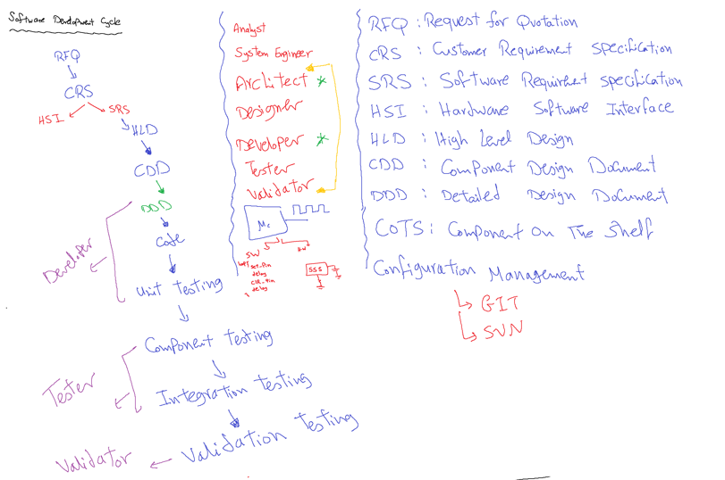
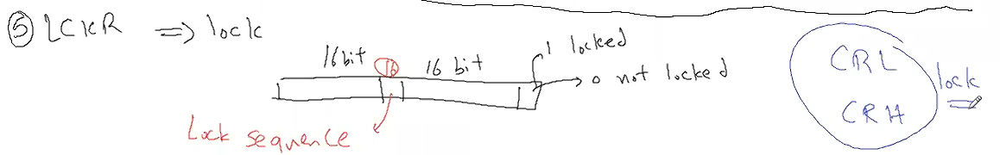
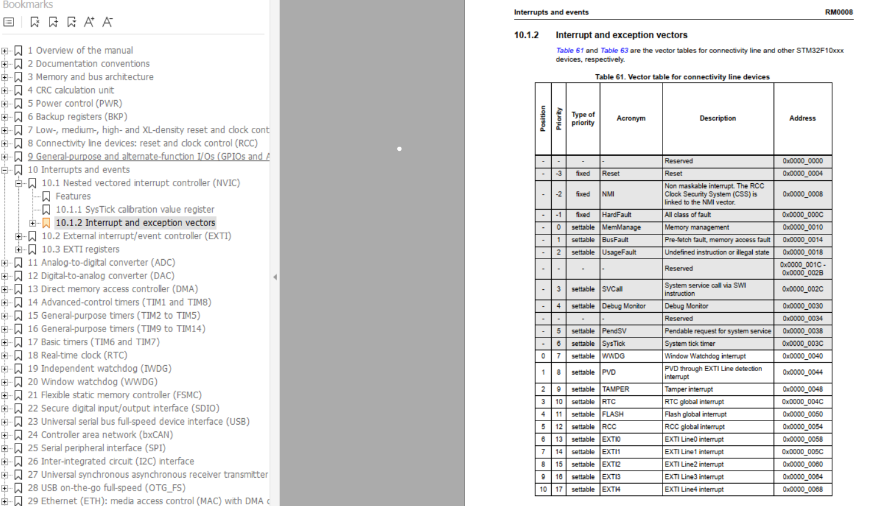
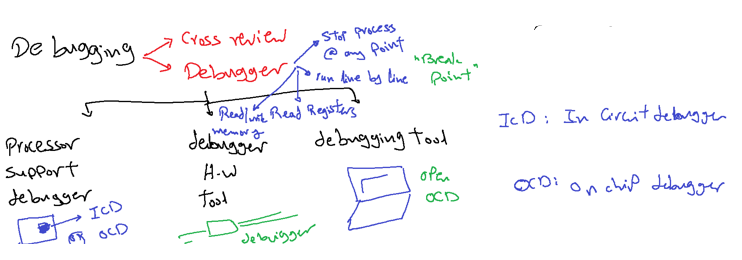
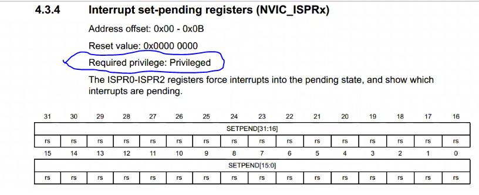
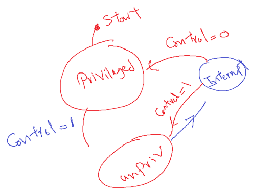
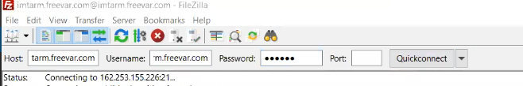
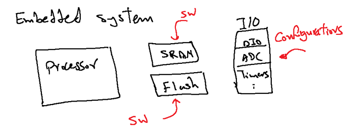
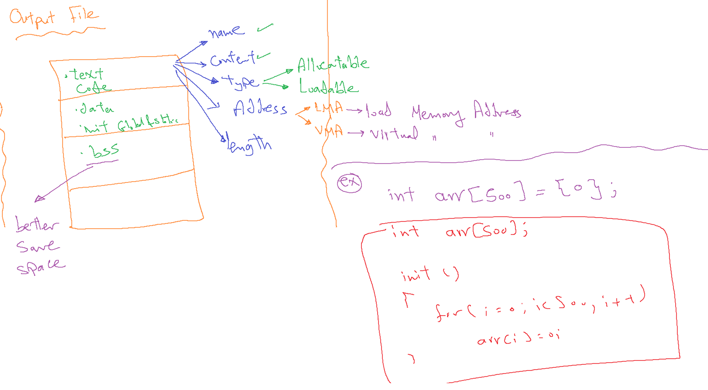

# ARM-M4
http://files.imtschool.com/ARM/
## This repo related to ARM M4 course preparation   


## CH0-History of ARM:
### The Beginning:<br /> 
## ⚡Acorn Computers Ltd <br />
Founded at **1980’s**.<br /> 
the reasoning behind the naming of Acorn was to be ahead of Apple computers in the telephone directory!<br />  Fast forward a few years they produce the BBC Micro, a government initiative to put a computer in every classroom in Britain with a little task of coming up with the microprocessor design for Acorn’s own 32 bit processor with little to no resources therefore the design had to be good and simple **Arm1**
<br />Development on the Acorn RISC Machine didn't start until some time around late **1983** or early **1984**<br />
**26th April 1985** **Arm2**<br />
 Acorn Archimedes which was released in 1987, was the first RISC based home computer<br />
 **1990 as Advanced RISC Machines Ltd**<br />
 tructured as a joint venture between Acorn Computers, Apple Computer (now Apple Inc.) and VLSI Technology. The reason for this was because Apple wanted to use Arm technology but didn’t want to base a product on Acorn IP – who, at the time were considered a competitor. Apple invested the cash, VLSI Technology provided the tools, and Acorn provided the **12 engineers** and with that Arm was born, and its luxury office in Cambridge – A barn!<br />
 <p align="center">
    
</p>

  **They created**  <br />
 Cambridge Processor Unit or CPU
 in 1993 the Apple Newton was launched on Arm architecture.
t wasn't the best piece of technology, as unfortunately Apple over reached for the technology that was available for them at the time - the Newton has flaws which lowered its usability vastly. Due to these factors Arm realized they could not sustain success on single products<br />

## ARM Supply processor architecture
 The Arm processor was licensed to many semiconductor companies for an upfront license fee and then royalties on production silicon. This made Arm a partner to all these companies, effectively trying to speed up their time to market as it benefited both Arm and its partners. For me personally

## TI, Arm7, and Nokia
The crucial break for Arm came in 1993 with Texas Instruments (TI). This was the breakthrough design that gave Arm credibility and proved the successful viability of the company’s novel licensing business model. The deal drove Arm to formalize their licensing business model and also drove them to make more cost-effective products. Such deals with Samsung and Sharp proved networking within the industry was crucial in infecting enthusiastic support for Arm’s products and in gaining new licensing deals. These licensing deals also led to new opportunities for the development of the RISC architecture. Arm’s relatively small size and dynamic culture gave it a response-time advantage in product development. Arm’s hard work came to fruition in 1994, during the mobile revolution when realistic small mobile devices were a reality. The stars aligned and Arm was in the right place at the right time. Nokia were advised to use Arm based system design from TI for their upcoming GSM mobile phone. Due to memory concerns Nokia were against using Arm because of overall system cost to produce. This led to Arm creating a custom 16 bit per instruction set that lowered the memory demands, and this was the design that was licensed by TI and sold to Nokia. The first Arm powered GSM phone was the Nokia6110 and this was a massive success. The Arm7 became the flagship mobile design for Arm and has since been used by over 165 licensees and has produced over **10 Billion chips since 1994.**
<p align="center">
  
    
</p>

## Going Public
By the end of 1997, Arm had grown to become a £26.6m private business with £2.9m net income and the time had come to float the company. Although the company had been preparing to float for three years, the tech sector was in a bubble at the time and everyone involved was very apprehensive, but felt it was the right move for the company to capitalize on the massive investment in the tech sector of the time.

On April 17th, 1998, Arm Holdings PLC completed a joint listing on the London Stock Exchange and NASDAQ with an IPO at £5.75. The reason for the joint listing was twofold. First, NASDAQ was the market through which Arm believed it would gain the sort of valuation it deserved in the tech bubble of the time which was mainly based out of the states. Second, the two major shareholders of Arm were American and English, and Arm wished to allow existing Acorn shareholders in the UK to have continued involvement. Arm going public caused the stock to soar and turned the small British semiconductor design company into a Billion Dollar company in a matter of months!
<p align="center">
  
</p>

## reference
https://community.arm.com/arm-community-blogs/b/architectures-and-processors-blog/posts/a-brief-history-of-arm-part-1
___
## ARM categories    

**ARM divided into 3 main categories** <br />
Cortex -A : [Application]For graphics and rich OS<br />
Cortex -R : [Response]For high response systems like antena <br />
Cortex -M :[Medium]For embedded applications <br />
**ARM categories performance**<br />


**ARM partners**<br />


**ARM Major characteristics**<br />
| High performance | Low cost | Low power <br />
|Enhanced determinisim | Ease of use | wide choices <br />

# ATmega32 VS stm32
| Comparassion    | ATmega32        |  STM 32F103C8T6 |
| :------------   |:---------------:| -----:          |
| Processor       | 8bit            | 32 bit          |
| Frequancy       | 16mhz           | 72mhz           |
| Flash           | 32K             | 64k             |
| RAM             | 2K              | 20k             |
| I/O             | 32Pin           | 35Pin           |
| Timers          | 3               |  9              |
| ADC             | 8 Channels      |  10             |
| USART           | 1               |  3              | 
| SPI             | 1               |  2              |
| I2C             | 1               |  2              |
| DMA             | N/A             |  1              |
| CAN             | N/A             |  1              |
| RTC             | N/A             |  1              |
| Power           | 5v              |  3.3v           |
 <br />
# How processor work
code is converted into machine language and stored in memory processor contains unit called control unit which contain fetching circuit to get instruction into processor then another circuit called instruction decoder satart to understand the fetched instruction, To understand instruction instruction decoder need two main informations OP code of each instruction for example ADD -->101 the second info is instruction format which divide instruction into three main parts OP code, operand1 and operand2 Another circuit is needed which is called ALU to perform opcode in selection signal to excuite opcode in operand1 and operand2 

**Register bank**
A set of registers in processor (small RAM) each location has special functionality for example 
01-PC program counter to track instructions in memory <br />
02-IR instruction register to store fetched instruction  <br />
03-ACC Acumulator which contains result from ALU <br />
04-PSW Processor status word which contains a set of flags(bits) for example overflow flag, negative flag[1111111]=255 or -1 this flag define negative one or 255, Zerro flag  <br />
05-GPR General purpose registers for fast accessing 
## Hints Dont forget to add some pictures for <br >01- beaglbone<br > 02- Intell galilio <br >03- Ti <br >
# What is new in ARM processor
ARM contains core prepherials exists in the processor <br >
01- NVIC      Nested vector interrupt controller<br >
02- SYSTIC    Timer inside the processor 24 bit <br >
03- MPU       Memory protection unit<br > 
04- ICD       in circuit debugger<br >
### Data buses <br >
01- Address bus<br > Bus neededd to address specific address
02- Data bus<br > Bus needed to transmit or receive data
03- Controll<br > bus Bus needed to send controll commands 
Bus set is a set of data, controll and address buses 
### Harvard Vs Vonnumen architecture
***Harvard is complex !***
Harvard has different asembly instructions for accessing specific bus set
if code in c then the diffult access is RAM bus set  
### Pipeliming concept 
in Harverd architecture there is different bus set for proividing excution of more than one instruction cycle at same time 

ARM Mix between harvard and von-numen
## Questions 
What is the difference between instruction cycle , clock cycle and machie cycle <br >
Clock cycle it generated from clock in hz<br >
Machine cycle the actual clock after prescaller<br >
instruction cycle number for cycle for fetching decoding and excuiting the instruction<br >
[Note]  
16/32 bit instruction is called thumb2 
insurction can be fetched in morethan one cycle for ASK ?

## ToDo
Cemsis<br >
Eclipse debugging <br >
Outlines <br >
## Lec2
***processor*** <br >
Each proecessor Control unit contains a fetching circuit for fetching the instruction and understand it using instruction format and instruction set to decode the instruction then the decoded instruction is enter to ALU to be excuited for op1,op2 and opcode which will be in the selector and then the result will bw in the accumulator <br >
***Memory*** <br >
Development time : Time of development 
Building time    : Time of building the code to get hex 
profiling        : getting memory size needed for uploading the code
Flashing         : Time of burning or flashing the code using flasher or programmer 
The code is represented in the memory using electrical signal on or off zero or one 
Memory can be implemented using:<br >
01- Capacitor  : Charged then one represented in the memory <br >
02- Transistor : Saturation mode "short circuit" which represent 1 
Open circuit mode "represent zero"

|Comparassion       |Transistor           | Capacitor      |
|----------|------------------------------|----------------|
|  Performande         |High                              |Low            |
|  Cost        |High                              |Low                |
|  Size        |Low                              |High                |
|  Power Consum.        |Low                              |High                |
|  Name.        |SRAM                              |DRAM                |

Cpacitor consume a high power because  a refreshment circuit is needed to save charge 
Note: Both DRAM And SRAM are volatile and will not save code text in the flash memory so a 
<br >***floating gate mosfet is needed***<br >
floating gate mosfet is non volatile 
01-Control gate: which receive the signal to be applied on the mosfet and need to be high power to penetrate isolator<br >
02-Isolator     : Exist between control gate and floating gate<br > 
03-Floating gate: a gate which hold the signal between source and drain<br> 
04-Source: like collector of transisor<br >
05-Drain : like transistor collector <br >
if ther a charge stored in the floating gate then Retention time will be 50 years and then it will lose it's charge 
Float gate mosfet may be:<br >
 01-charged then applied signal to gate is zerro
 <br >02-Not charged then applied signal to gate is 1
<br >Note : when the memory is cleared then it will contains ones 
Disadvantages of floating gate mosfet:
01- Nonvolatile    : Which read only for processor and processor can't write over it 
02- Need High powr : to break floating gate mosfet 
### Memories based on float gate mosfet:
***Masked ROM:***
A memory which come already programed and we can't programe it 
<br >***OTP ROM:***
A memory which can be programed only once by the user  
<br >***EPROM:***
Erasable programable ROM can be programed using burner by electricity and can be erased by ultravilot `Widdly used in weapons manufacturing `
<br >***EEPROM:***
Electricall ersable programble can be programed and erased using electricity
<br >***Flash:***
Electricall ersable programble can be programed and erased using electricity

|Comparassion       |EEPROM           | FLASH      |
|----------|------------------------------|----------------|
|  Accessing[write/erasing]         |Byte access                              |Block access            |
|  Cost        |High[need more transistors to access byte]                             |Low                |
|  Endurance        |100,000 write erase                             |10,000                |


[Note]
To undertand relation between flash and EEPROM <br >
Flash access time for example take   10us <br >
EEPROM access time for example take   1us <br >
Case1: Write one byte ``EEPROM`` Will consume 1us and ``Flash`` will consume 10 us which means EEPROM is faster for byte access 
<br >Case2: Write 100 bytes ``EEPROM`` Will consume 100us and ``Flash`` will consume 10 us which means flash is faster for block access<br >

***conclusion:***<br >
Memory divided into two main types <br >
01-Volatile     : [RAM(SRAM-DRAM)]<br >
02-Non-Volatile : [ROM(MASKED-OTP-EPROM-EEPROM-FLASH)]<br >

## Micro controller architecture 
processor contains bus set and flash also contains a bus set which allows processr to be able to access flash one of buses in the bus set is the data bus wich able to connect to a ***specific locations with a specific word size or location width*** so each processor contains memory size to be able to connect a specic size of memory based on address bus and processor contains a specific word size to be able to implement [fetch-decode-excuite]cycles on it 

## Harvard Vs Vonnumnen 

## ARM Architecture 
Arm is internally harvard architecture which appear as vonnumen have single bus set And contains three main bus set<br >
01- IBUS :Instruction Bus -->|------------ |              
02- DBUS :Data Bus-------->|   Bus Matrix   | ------>single Bus set      <br >
03- SBus :System Bus ------>|------------ |          <br >

Bus matrix convert addresses by adding offsets to the address nedded by the processor when one of the BUS set is need to communicate with other memories of RAM, Flash and IO Memory 
## Lec3
ARM Set a protocol to the vendor to follow through manufacturing 
the protocol is called **AMBA** Advanced microcontroller architecture AMBA contains a set of protocols which can be followed by the vendor, The main two protocols in AMBA are <br >
01- AHB Advanced High Performance bus 
      - High Power<br >
      - Complex design wiring  <br >
      - Multi master "More than one prepherial can start communication"
      - Full douplex<br >

02- APB Advanced Peripheral bus<br >
      - Low Power<br >
      - less complexity<br >
      - Low performance <br >

The bus set which out of bus matrix is AHB advanced high performance bus
the peripherials made by vendor will be coonnected to this AHB protocol for example RCC <br >
there is a bridge which is used to convert from AHB to APB as shown 
<p align="center">
  
</p>
Note in the above picture all not in red colour is designed by ARM 
if all prepherials are connected to AHBspeed[72Mhz] it will consume a high power so connect to more lower power protocol APB2 is higher speed[72Mhz] than APB1[36Mhz]

# Steps of programming the chip :
01- Know about needed documents to read from 
02- Know prepherial Bus[AHP-APB] from ST document 
## The Documments 
***ARM*** : Programming manual if you need to get information about coreprepheral<br >
***ST***  : Register description for getting information about vendor prepherial <br >

To know the bus which the prepherial will be connected to open st document "Register description" to get the conected bus 
## AHP Bus connected prepherials 
Note Boundery address is the register reserved addresses 
<p align="center">
  
</p>
APB2 
<p align="center">
   
</p>
APB1
<p align="center">
   
</p>

--------------------------------------------------------------------
## Software development cycle 
<p align="center">
   
</p>

01-***RFQ***:At starting of the project business analyst responsible communicate with the customer to make RFQ `Request for qutation`Document which based on defining cost and time of the project <br >
02-***CRS***:Customer requirement specification detailed technical requirement in the SW which developed by the technical team which converted RFQ into CRS 
The Requirements may be done by `system engineer` who define that  <br >
HSI : Hardware software interface to define hardware requirement document which is hardware team responsibility  <br >
SRS : Software requirement specification document which is sw team responsibility  <br >
03-`System ARchitect`: a person who responsible for making static architecture and dynamic architecture to produce HLD Document `High level design document`<br > 
<p align="center">
   
</p>

***Static Architecture*** : define system software component in layerd model or layerd diagram which named as  [sw component = sw module =sw driver] and consist of:<br >
01-MCAL : contains in controller prepherial : DIO,ADC,UART.....[FirmaWare Engineer responsibility]<br >
02-HAL  : Hardware abstraction layer [FirmaWare Engineer responsibility]:Motor,TFT,WIFI...........<br >
03-APP  : Main which contain the system sequences [Application Engineer responsibility]<br >
Note : any component can call a component from the layers which is down 
one of the common component in the static architecture is the Lib which is called by the other layer and can no't call any layer for example `stdTypes`<br >
Static architecture contains a tables of function names, Arguments and return values <br >
***dynamic Architecture*** :contains all informations related to [Excution time of each function - function ram consumption - ROM consumption `flash` ]<br >
04-`Designer` design a diagram for each function using UML language which descripe how it will work according to system architect requirements as memory and excution time  [Flow chart "Activity diagram", State machine, state chart , sequance diagram] the designer responsible for making ***CDD*** document or each software component <br >
<p align="center">
   
</p>

05-`Developer` responsible for 
DDD :detailed design document which is an optional step as psoducode for the system  and made by developer <br >
06-unit testing : for each function  `by developer`<br >
07-Component testing : each swc alone testing  `tester`  <br >
09-integration testing : integration of all software components `tester` responsibility<br >
10-Validation testing  : Upploading the sw on the board and done by `validator`  <br >
Other supporting positions in the development : Quality assuarance and tooling 

# Q&A
ARM IS HYPERD :actually arm is Harvard but it is working as vonnument because of bus matrix  <br >
01-What advantages of core prepherials : fast access and reusability incase of dealing with the same core such as  stM4 like  TIVA M4 software <br >
02-what is cash memory : sram exists in the processor and faster than external ram and slower than GPR <br >

------------------------
Files in c .h and .c : .c is compiled file and .h is included inside .c file 
Note file Guard is very important to avoid calling more than one file at the same time 
<p align="center">
   
</p>

### Clock system :
is a periodic pulses to organise fetch microcycle, decode microcycle and excuite microcycle cycle 
main types of clock may be </p>
01- Electrical </p>
02- Mechanical </p>
        -Ceramic `Oscilator`</p>
        -Crystal `Resenator`</p>
Note settling time is the time needed to reach steady state 
<p align="center">
   
</p>

# Lec4

ARm is Harvard Architecture but act as vonnumen becuase of bus matrix
The main step to deal with any prepherial is to know the the bus which will be connected to to know it's clock frequency will be suitable or not<br >
***RCC*** :Reset and clock controll responsible for controller reset and adjust system clock, this prepherial is vendor prepherial made by ST to controll arm processor clock <BR >
`Processor Bus matrix, AHP, APP and bridges are made by ARM `
<p align="center">
   
</p>

RCC CAN supply three types of clocks and connected bypass through xtal1 pin and xtal2 not connected <br >
HSI : High speed interanal "Interanl clock" of RC type provide 8Mhz 

HSE : High speed external "External connected clock" may be RC or Crystal type `4-16 Mhz incase of Crystal` type and up to `25 Mhz incase of RC`

PLL : Phase locked loop to amplify the clock <span style="color: green"> can work with internal clock to amplify it, PLL internal clock is RC</span>

Note: Processor able to work with 72 Mhz but from PLL<br >
Rcc provide processor clock selection  

<p align="center">
   
</p>

RCC : Responsible for Enabling and disabling clock which will be passed to the controller 
Q: Does prepherial consume power incase of enable bit is off answer is Yes 
<br > Because there is a circuit which is called `enable check circuit` check if prepherial enable pin is active or not, we can disable enable check circuit by switching off the clock using RCC 
  
So rcc can be use used to enable prepherial clock and select clock value 
<br >

Elements which have clock by default are :<br >
01 - RCC <br >
02 - Core prepherial 
<p align="center">
   
</p>

<span style="color: red"> [NOTE] : There is a memory buffer register responsible for data instruction to fetch data  </span>
<span style="color: green"><br> Crystal connected to micro controller XTAL1 and XTAL2 where RCC is connected to external vcc ...? <br>Becuase RCC need stable dc without ribbles and microcontroller output dc not sharp dc   </span><br>
<span style="color: red">  How pll works internally...?  </span>


## Writing of a driver 
- prepare files 
- Prepare inclusions 
- define registers <br >


drive have a naming convensions where `XYZ` is driver prepheral name<be >
Driver consists of main two sections <br >
01- Fixed : Un touchable 
02- Configurable `able to use driver options according to the implemented configuration` 
<p align="center">
   
</p> <br >

### Rules to include in .c file 
01 - Lib <br >
02 - Interface file of lower layers <br >
03 - Own driver file `Interface - private - config `

----------
ST has 3 production lines 
   - Low denisty 
   - Medium denisty 
   - High denisty
   - Conectivity line <br >
We are intersted in medium denisty 
---------------
To be able to program RC prepherial open Register description document which relevant to the vendor <br >
AS shown from section 7.3.1 to 7.3.10 exists the description of RCC 
   <p align="center">
   
</p> <br >
section 7.3.11 contains register map<br >

- Each prepherial contains base address which is the first address in this prepherial  <br >
- Each register has it's offset from the base address 
- Address of any register = Base address + offset 
<p align="center">
   
</p> <br >
where to get base address from ...? <br >
As shown here from memory map section we can go to the relevant bus which the prepherial will be connected to and then we will find prepherial name and it's base address as shown [0x4002 1000 - 0x4002 13FF]

<br >

<p align="center">
   
</p> <br >

------------------
```
Writting the registers to the code `casting`
0x40021000 = 4 ;    /* is wrong and will produce Lvalue error 
                     its needed to be casted */
#define RCC_CR               *((u32*)0x40021000)
RCC_CR = 4    ;     
```
```
/****************Choseing CLK in processor******/
#define RCC_CR             *((u32*)0x40021000)
#define RCC_CFGR           *((u32*)0x40021004)
/***********************************************/
#define RCC_CIR            *((u32*)0x40021008)
#define RCC_APB2RSTR       *((u32*)0x4002100C)
#define RCC_APB1RSTR       *((u32*)0x40021010)
/***************Enable and Disable CLK***********/
#define RCC_AHBENR         *((u32*)0x40021014)   
#define RCC_APB2ENR        *((u32*)0x40021018)
#define RCC_APB1ENR        *((u32*)0x4002101C)
/***********************************************/
#define RCC_BDCR           *((u32*)0x40021020)
#define RCC_CSR            *((u32*)0x40021024)
#define RCC_CR             *((u32*)0x40021028)
```
## RCC_CR
This register responsible for enabling and disabling of :<br >
01 - HSI<br >
02 - HSE<br >
03 - PLL<br >
Clock security system`CSS`
Responsible for activation of internal clok incase of external clk faliour<br > 
0 : Not Enable <BR> 
1 : Disabled 
HSITRIM[4:0] :
Responsible for trimming `correction by increasing or decreasing of clock by binary digit 40khz`
default 1 0 0 0 0 <BR> 
HSICAL[7:0] :Responsible for reading current existing clock which reached to the system to be corrected by HSITRIM the value is updated only once 

EX: HSICAL Measured 8Mhz+250khz HOW TO get 8Mhz CLK ...?<br>
HSITRIM = 01010   = 8mhz+10k
<p align="center">
   
</p> <br >

## RCC_CFGR
<p align="center">
   
</p> <br >

As shwon RCC responsible for 
<p align="center">
   
</p> <br >

***MCO[2:0]*** : Responsibl for sendding clock to external pin MCO pin and this pin is very important for diagnostics to know the current clock and set trimming value, also is important for clock cascading by operating of more than one controller using one clk which provide synchronization `all controller have same error synchoronized` disadvantage not save  <br >
<p align="center">
   
</p> <br >

***PLLSR***   : responsible for passing HSI/2 or HSE to PLL <br >
***PLLMUL***  : Multiplication factor 16 case to multiply pll value <br >
Note : incase of PLLMUL produce clk greater than 72Mhz then rcc will not work<br >
why there is option to divide HSE by 2 : to be able to generate the clock  value you need and reach to 72Mhz <br >
ex Crystal 16Mhz : need to generate 72 Mhz <br >
<p align="center">
   
</p> <br >

Question : why there is a need to read system clock from SWS[1:0] is important than sw[1:0] ? Because security system clock pin may switch to internal clock so SW will give the actual connected clock 

# Lec 5 
As shwon RCC responsible for 
<p align="center">
   
</p> <br >

Types of configuration :<br >
01 - Prebuild `Prepocessor directives`<br >
  - Use # define so it's need to be rebuild of the code and consume low memory  `Can't change configurations in runtime `<br >
02 - Link time configuration :<br >
  - Configuration prameters exist in .c file and the program is compiled and given to the user as .obj file to be linked with configuration paramters  `Can't change configurations in runtime ` provide security to the code 
  <p align="center">
   
</p> <br >

03 - Post build configuration :<br >
  - A data in a memory and the code read this configuration data during the  runtime by changing of the configuration prameters during runtime    

  # GPIO :
  General input output pins contains 35 io pins in 3 ports<BR >
  01 - PORTA  0 :15 <BR >
  02 - PORTB  0 :15 <BR >
  03 - PORTC  C13,C14,C15 <BR >
  GPIO pin may be input or `output low or high` <br >
  GPIO Provide source current incase of output `SOURCE` as 25 ma incase of forward connection <br >
  GPIO Receive current incase of input `SINK` as 150ma incase of reverse connection <br >
  Note portc provide source current as zero a it works only as `sink`<br >
   <p align="center">
   
</p> <br >

### Data direction register 
Each GPIO PIN has 4 bit 16pin*4=64 bit 
so two register are needed <BR >
CRL : control pins from pin0 to pin 7<BR >
CRH : control pins from pin8 to pin 15
   <p align="center">
   
</p> <br >
Each pin has 4 bit dividded into two main sections as shown and incase of output we able to define output frequency from the pin to reduce used power incase of low change on the pin <BR >

***Surprise*** Any pin is able to work as ADC <br >
AF      : Alternative function `Function not for DIO example for i2c`<br >
Pushpull: 0 = 0 volt , 1 = 3.3 volt <br >
   <p align="center">
   
</p> <br >
Each port has 7 registers :<br >
CRL   <br >
CRH<br >

IDR `iNPUT DATA REGISTER `<br >
ODR `OUTPUT DATA REGISTER `<br >
   <p align="center">
   
</p> <br >

Conclusion <br >

there is two registers responsiple for the 32 pin <br >
CRL for first 16 bits <br >
CRH for the last bits<br >
each pin has four bits two for mode (input or output )<br >
and two for configuration (push pull -open drain- AF) <br >
Also there is a register which called ODR output data register <br >
and IDR input data register for output <br >
   <p align="center">
   
</p> <br >

# Lec 7


- Open drain concept <br >
     <p align="center">
   
</p> <br >
Usages :<br >

  - Motor direction control with any voltage [Configurable High level voltage]
       <p align="center">
   
</p> <br >

- Open drain bus `Multi number of node communicate through the same line without short circuit ` such as [CAN - LIN - I2C]
       <p align="center">
   
</p> <br >
     
----------------------------
## LED Power :
 main types of USB <BR >
 USB current varry accordding to the types as shown
        <p align="center">
   
</p> <br >
LED power from 40 to 160w so usb will burn the led <br >
Controller current around of 25ma  <br >
        <p align="center">
   
</p> <br >

### Bit Set Reset Register [BSRR]
Consist of two sections set and reset the bit directly by writing one on it which provide efficency in writing more than `ODR` Register
        <p align="center">
   
</p> <br >

### Bit Reset Register [BRR] 
Responsible for resetiting the pin directly, The higher part of the register has no usage
        <p align="center">
   
</p> <br >

### Use case for BSRR, BRR And ODR 

<p align="center">
   
</p> <br >


### Lock register [LCKR]
It's a register responsible for locking the mode of the pin to not be changed in CRL AND CRH during the runtime 
<p align="center">
   
</p> <br >

## Interrupt
Processor has Interrupt pin when an event occur it will signal the processor <br >

Types of interrupts : <br>

<p align="center">
   
</p> <br >

Interrupt handling :
<p align="center">
   
</p> <br >
Types of interrupts :<BR>
1- Vectorable : <BR >
During Compilation all ISR is distributed according to the linker and startup code distribute the addresses of all the ISR according to it's relevant location index in the vector table <br >
-   Prephiral send pulse to pic Circuit when PIF And PIE is enabled <br >
-  PIC write the number of prephiral into memory Index of PIC <br >
-  PIC Send pulse to processor <br >
-  Processor read index register<br >
-  Processor Jump to vector table  <br >
-  Processor find the corrosponding index and jump to the address of the ISR to excuite it <br >

What happen incase of more than of one interrupt happend ? <br >
- Vectorable interrupt is `Fixed Priority`
<br >
According to the Priority in PIC Circuit `Index of Interrupt` defined by the manufacturer<br >

2- Flexable Priority:<br>
Exist in PIC Micro controller 
- Any interrupt occur PIC Generate pulse to processor 
- Processor Jump to interrupt vector `Not vector table` only one location
- Processor find the address of ISR to excuite it and it contains a specific SW by the developer according to the Enbled PIF <Br >
- The priority of excution can be handled by the developer 
<p align="center">
   
</p> <br >
Comparssion between flixable priority and vectorable :<br >
Vectorable : Fixed priority - Hardware handled `Faster` - Low interrupt Latency `Fixed `  - Like AVR <br >
Flexable Priority : Flexable priority - sw handled `slower` - High interrupt Latency `Varaible Latency ` - Like PIC <br >

### Flag Clearance 

  After interrupt occurance there is a need to clear the flag to be able to detect interrupt occurance 
  Clearing methods of flag clearance : <Br >
  - By hardware 
  - By writing Zerro
  - By writing one to the flag
  - By Reading flag 
  ### Interrupt Nesting 
  Occuring of interrupt during the excution of current ISR may be one of two 
  - Support nesting 
      - Normal nesting `Higher priority interrupt cut the currently excuited interrupt ` and normal nesting has maximum level of nesting 
      - Self nesting : Interrupt is excuiting and the same interrupt happend again during excution eg Timer over flow 
  ## Interrupts in ARM
  ### The INVIC: nested vectored interrupt controller <br >
  CorePrephiral `Lowest Latency time` + Standard related to ARM <br >
  Support 255 inturrpt 240 external + 15 internal 
<br >
Vector table based system 
## ARM M3 NVIC 
There is and gate inside the controller relvent to the external interrupts to enable and disable it <br >
* Support Normal nesting  255 Level <br >
* support both SW and hardware priority 
* Each interrupt has priority register <br >
* SW developer can assign value for each priority <br >
* if SW Priority not defined then processor will look at the hardware priority 
* Support sumlation of other prepherials interrupt through enable interrupt occurance using SW 
<p align="center">
   
</p> <br >

## NVIC external interrupts
<p align="center">
   
</p> <br >

- Each EXTI has two falg active `Running` Flag and Pending `Exist but not happend ` flag 
- NVIC is Core prepherial 
- Manage 255 interrupt
- 1:15 are internal interrupt and 16 to 255 are external 
- The numbering represent the priority `internal interrupt are higher priority`
- inside NVIC Each external inturrept input has it's Enable bit 
- prephirals interrupt flag PIF enter to NVIC 
- NVIC is able to enable and disable `mask` All external interrupts PIF 
- Some prepherial has PIE before NVIC as shown 
- All external prepherials are masked in ARM
- interrupt signal which enterd to NVIC AND Gate is called `Pending Flag`
- Active flag is always one during ISR excution
- Each interrupt has two flags pending Flag and Active `Running` Flag <br >

***Status of Pending and active flag***
<p align="center">
   
</p> <br >
Conclusion : 
NVIC Manage all interrupt but controll only external interrupt <br > 
NVIC Control EXTI trough :<br >

-  Enable
-  Disable 
-  Set Pending Flag
-  Clear Pending Flag
-  Change priority
NVIC Manage internal interupt trough :<br >

- NVIC Allow internal interrupt to excuite according to it's priority  
- NVIC Can't set and clear pending flag for core prepherials 
- Coreperipherials interrupts priority can be handeled through the coreprepherial itself 

## Interrupt priorities 
Each interrupt internal or external has two priorities <br >
01 - SW Priorities    [0`Highest` --->255`Lowest`] <BR >
02 - HW Priorities    [Position of interrupt at NVIC ] <BR >

- All internal interrupts has hardware priority higher than external interrupt
- By default all interrupts sw priority is zerro
- if SW Priority not set then HW priority will be the reference 

## Nesting 
- NVIC NOT supporting self nesting 
- NVIC support normal nesting 
### Interrupts self nesting 
<p align="center">
   
</p> <br >
Each interrupt has two priorities :<br >

- Group priority <br >
- Sup periority  <br >

Each group has it's own priority 
<p align="center">
   
</p> <br >

- Group zerro is the highest priority 
- Group zerro contains `ADC - TIMR - UART`
- Each interrupt has it's own sub priority in each group As shown 
- No nesting in the same group and nesting exist only between groups 

 ### EXAMPLES 

 <p align="center">
   
</p> <br >  

## Vector Table
- Vector Table has fixed location
- ISR Routines are located in different location in flash memory 
- Vector table may be in RAM or FLASH 
    - Static vector table <br >
      -   No Change of isr routines address in runtime 
      -   Exist in flash memory
      -   Burnner flash vector table according to hex file location of each interrupt and the address of the relevant isr 
      -   No need run time to be intialized because it is intialized by efault  

    - Dynamic vector table <br >
      -   Change of isr address in runtime is possible 
      -   Exist in RAM in .vector secssion 
      -   Startup code is the first code run and responsible for intializing vector table incase of this vector table in RAM 
      -  Need time to intialize vector table in ram so startup code disable all interrupts untill vector table is  intialized 

ARM default vector table is static 

## NVIC Driver : 
Documents : <br >

-   Register description document
    - To make st driver  
There is three interupt has fixed priority but maskable 

<p align="center">
   
</p> <br >  

-   Programming manual document
    - ARM Drivers `NVIC Base address `
<p align="center">
   
</p> <br >  

 [Note]      
 - There is specific address for the external prepherial to make processor able to access it 
 - The coreprepherial don't has address but each coreprepherial has assembly index or instruction to be addressable 
- To be able to access core prepherials in C ARM Made memory mapping for some coreperipherial  or `Mirroring` to avoid assembly usage 
- NVIC is memory maped 

<p align="center">
   
</p> <br >  


## NVIC Registers `From programming manual`

### ISERx 'Interrupt set enable register'
A set of  32 bit registers to enable external interupts up to 240 EXTI but in ARM M3 contains up to 59 EXTI interrupt 
<p align="center">
   
</p> <br >  

### ICERx 'Interrupt Clear enable register'
To disable the interrupt of a specific prepherial 
<p align="center">
   
</p> <br >  

### ISPR 'Interrupt set pending register'
To set pending flag for debugging reasons 
<p align="center">
   
</p> <br >  

### ICPR 'Interrupt clear pending register'
To clear pending flag for debugging reasons 
<p align="center">
   
</p> <br >  

### IABR 'Interrupt active bit register'
Contains state of active flag 
<p align="center">
   
</p> <br >  

### IBRx'Interrupt Priority register'
Responsible for each interrupt priority, each IBR register responsible for four interrupts, 
<p align="center">
   
</p> <br >  
This register responsible for group and priority 
<p align="center">
   
</p> <br >  
<p align="center">
   
</p> <br >  
Examble EXTI cut EXTI0
<p align="center">
   
</p> <br >  


## SCB `System control block coreprepherial`
### AIRCR `Application interrupt and reset control register `
<p align="center">
   
</p> <br >  
- the upper 16 bit are the key or password  `0x05fa` to be able to write in the register otherwie processor will ignor the writing 
- There is three bits responsible for selecting group and sub group priorities 
- xxxx for group priorities 
- yyyy for sub group priorities 
- This register control [IBRx](#IBRx) Priorities

<p align="center">
   
</p> <br >  

Three bits grouping and sub grouping 
<p align="center">
   
</p> <br >  

```
                            /**Grouping and sub grouping /
/* in (SCB => AIRCR) 4 bits for group and 0 sub => 4bits in (IPR) to determine group number	*/
#define		GROUP4		0x05FA0300 
/* in (SCB => AIRCR) 3 bits for Group and 1 bit for sub										*/
#define		GROUP3		0x05FA0400 
/* in (SCB => AIRCR) 2 bits for Group and 2 bit for sub										*/
#define		GROUP2		0x05FA0500 
/* in (SCB => AIRCR) 1 bits for Group and 3 bit for sub										*/
#define		GROUP1		0x05FA0600 
/* in (SCB => AIRCR) 0 group for 4 bits for sub												*/
#define		GROUP0		0x05FA0700 
```
API To set group and sub group 

```
void MNVIC_voidSetPriority(s8 Copy_s8IntID , u8 Copy_u8GroupPriority ,u8 Copy_u8SubPriority )
{							/*0x05FA0400 3 Group & 1 sub priority*/
	u8 Local_u8Priority = Copy_u8SubPriority|(Copy_u8GroupPriority<<((NO_OF_GROUPS_SUB - 0x05FA0300)/256));
	/* core peripheral 			*/
	if(Copy_s8IntID < 0)
	{

	}
	/* external peripheral		*/ /*EXTI0 = 6*/
	else if(Copy_s8IntID >= 0)
	{
		NVIC_IPR[Copy_s8IntID] = Local_u8Priority << 4 ;
	}
	SCB_AIRCR = NO_OF_GROUPS_SUB ;
}

```

# EXTI 
After handling NVIC we can get EXTI address from register description
<p align="center">
   
</p> <br >  

<p align="center">
   
</p> <br >  

```
typedef struct{
	volatile u32 IMR;
	volatile u32 EMR;
	volatile u32 RSTR;
	volatile u32 FTSR;
	volatile u32 SWIER;
	volatile u32 PR;
	
}EXTI_t;

#define EXTI ((volatile EXTI_t *) 0x40010400 )
```

There is 15 line related to 15 interrupt for each pin A,B and C as shown 
<p align="center">
   
</p> <br >

we can configure the EXTI line through 
##  IMR
configure the EXTI line  
<p align="center">
   
</p> <br >

## RTSR
Configure EXTI line latching  as rising edge triggerd 
<p align="center">
   
</p> <br >

## FTSR
Configure EXTI line latching  as FALLING edge triggerd 
<p align="center">
   
</p> <br >

[ NOTE ] For on change set both FTSR AND RTSR 

## SWIER  
Responsible for SW interrupt
<p align="center">
   
</p> <br > 

# EXTICRx
To configure port A or b or c as EXTI with it's pin 
<p align="center">
   
</p> <br > 

Example to configure pin 3
  - select line 3 from IMR 
  - select section 3 to select port A or B or C at line 3 `pin3`

  # Debugger Configuration 
  <p align="center">
   
</p> <br > 
<p align="center">
   
</p> <br > 
<p align="center">
   
</p> <br > 

# Lec 10 
### Termonology

- Development : Writing the code 
- Building    : Generation of excuitable file 
- Progrmming / Building / Flashing / Downloading : Downlaoding hex to flash of micro controller 
- Debugging : Searching for a bug using 
  - cross review through searching using eye 
  - Debegger : 
      - need controller which support debugging 
        - Contains OCD or ICD 'In circuit debugger '
      - need debugger
        -   ' To be able to stop processor at any point '
        -   Run line by line 
        -   Read different registers 
        -   Read or write register memory at run time 
        -  Any debugger able to flash SW 
        - ST LINK UTILITY 'Able to flash SW '
        - Open OCD able to flash and debug 
      - need debugging tool 
          - Plugin on eclipse called open OCD 
<p align="center">
   
</p> <br > 

## Termonologies 

- Simulator 
  - SW programe simulate controller behaviour 
  - Setuped on PC 
  - Not 100% real    
  - ot real time 

- Emulator :
    -  Target + debugger >> without need to the controller itself 
And Emulator support more than one target  
    
  - used incase of the target not known yet  
  - costly 

- Burner : 
  - Flashing for code on micro controller flash memory 

- Debugger : 
   - Flashing + debugging 

# SYSTIC 
## Basic concepts :
Couter / Timer : <br >
<p align="center">
   
</p> <br > 

 - Is a register be default contains zerros 
 - Counter register width is called `Resolution `
 - Counter count with each edge Rising/falling 
 - Counter can be connected to sensor and count asynchrounously 
 - Counter can be connected to clock and then count synchrounsly 
 - Timer is a counter which count clock 
 - Timer time {Tick time }is equal 1/F `timer`
<p align="center">
   
</p> <br > 

 - Timer value at any time = Register value * Tick time of the timer 
<p align="center">
   
</p> <br > 

- Timer over folw occur when register is full 
<p align="center">
   
</p> <br > 

## SYSTIC Features 

 - Coreprepherial 
 - Memory mapped `Can be accessed using C`
 - Standard `Any cortex M3 Contain systic`
 - 24 Bit resolution 
 - Timer Only `Input always Clk`
 - Timer input clk May be AHB or AHB over 8 
 - Count down Give interrupt when it reach zerro `Under flow interrupt`
 - its ISR function writen as ```void systic_Handle(void)``` because it's internal interrupt 

 Example on systic `Need systic to count 100 msec`

<p align="center">
   
</p> <br > 

## SYSTIC registers

### CTRL Control register 
Systic can't be enabled using NVIC because it's core prephiral 
- ENABLE 
- TIC INT  `interrupt Enable `
- CLKSOURCE `Clk source AHB or AHB/8`
- COUNTFLAG `Flag cleared when read`
<p align="center">
   
</p> <br > 

### LOAD load register 
- Is used to load number of ticks to be count 
- Hardware move the count to VALUE Register to be loadded again after underinterrupt from Load register 
<p align="center">
   
</p> <br > 
<p align="center">
   
</p> <br > 

### LOAD load register <p align="center">
Actual counting value which will be loadded from load register 
   
</p> <br > 

Conclusion for SYSTIC register 
W

   
</p> <br > 

What is the difference between API `Application public interface ` and private function : <br >
API can be called at different SWC but private function can not <br > 
What is the difference between synchrounous and Asynchrounous function ? 
<br >Synchrounous Function or `Busy wait func`is will not  return unless it's functionality is not finished and Asynchronous function will return before finishing it's functionality  .
<br >
Pointer To function :
it's a varaible which points to function  where the name of the function is it's address 
 
</p> <br >

---------------
# OpenQuestions
## Volatile       
 
</p> <br >
the variable X value will not changeable so the tool which is called optimizer will cach x into GPR and then the value of x will not be changed 
, If there is there is need to change the variable x for example through hardware or inside ISR then x will not be cahnged so the word voltile will prevent the variable x from being cached 

 
</p> <br >  
 
</p> <br >  

The wayes of falior
- Change by hardware 
    - Interrupt
    - Register change
    - MultiTasking `Change in same variable between while loops` 


    
</p> <br > 

## Function call VS SWI 
    
</p> <br > 
Function call 

- Can be normally interrupt unless critical section is called 
- Has different context switching 
    * PSW NOT includded in context switching 

SW interrupt

- May not be interrupt without critical section if nesting is not allowed 
- Has different context switching 
    * PSW includded in context switching 

# ARM Operational Modes 
  
</p> <br > 

  - Privilage 
       - All registers can be accessed 
  - Non privilage 
       - Not all registers accessable 
<br >
 - good practice after intialization convert from privilage mode to unprivilage 
 - To convert from privilage to unprivilage you must convert in interrupt so Software interrupt will be helpfull in this case to convert from privilage to unprivilage because all interrupts run in privilage mode and all function call run in the same mode and can not change from privilage to non privilage 
      
</p> <br > 


--------------------------------------------------------------------------------------

# Session13 LedMatrix
Displays 
Used to send vissual message sending or attraction <br >
Types :<br >
  - Segment Display <BR >

      
</p> <br > 

-  7segment  
         - Alpha numeric <br >
         Advantages : <br >
          Ease of programming<br >
          Attracive `High intenisty `<br >
          Disadvantage :<br >
          Consume many dio pins <br >
          Consume High power <br >
          Rigid to specific application such as traffic signs <br >

- Led matrix display <br >
Drowing a specific shape using leds 
Advantages : 
      Very attractive <br >
      Flexiable to drow any shape  <br >
Disadvantages        <br >
      Not easy to programme  <br >
      High Power
      Consume big io number  <br >

## Led Matrix concept :

 
</p> <br > 

Specifications : <br >
  - Size x*y  nuber of leds eg 8Coloumns * 8 Rows   
      
</p> <br > 

  - LedMatrix physical connection 


  - Modes of operations 
        - Coloumn controll Active coloumn at time <br >
        - Row controll 
Never activate two coloumn at same time 

# How it works : 
Using presistance of vission  POV 
### POV Concept 
   
</p> <br > 

Human Eye average limit 25 frame/second

LED matrix Algorithm : 
   
</p> <br >


# Infra Red
Light which can't be detected by human eye because it's wave length is lower than human detectable light and very high speed because it's same as light speed 
   
</p> <br >

## Advantages 
- Simple 
- Low Cost 
- Effect on the product cost 
- Up to 10 meter length of effect 
- Can't be seen 

## IR Challenge 
- Need to be On sight location 
- Interference with the abient light noise may occurs 
- Sending IR with light frequency which not exist in the ambient will be 
- helpfull for example 38kHz 
- Maximum number of remote controllers at the same location are limitted to address location in the frame  

- Hackable `CARS Which was working with IR Door controll was hackable `

   
</p> <br >

## IR System 
   
</p> <br >

###   Transmitter [Remote Controller]
   
</p> <br >
Consist's of IR Led connected to GND and Emulator to generate specific frequency `38Khz` by the led 

### Receiver 
is IR Receiver connected to 3.3volt, GND, And output between 0 and 1 `1 Is the default output ` if `The frequency is 3.3Khz` and then will be connected to modulator `Controller ` to send action to the actuator 

## Receiver Protocol
Transmitter send encrypted data to the receiver then a decryption is needed 
### NEC Protocol 
Comes from NEC Company which is Japaniese company  which nowdays is called renesas in Tokio
### IR Protocol
#### How to send zerro and one through NEC Protocol : <br >
   
</p> <br >

To send Zerro
-   Transmitter Send pulse train with a time length of ` 560Microsecod ` then send zerro for `560Microsecond `then this train will represent bit of Logical Low To send Zerro, Then receiver will sense a value of low 

To send One 

- Send same a pulse train with same as logical low but send zerro for ` 1687 Microsecond ` 

Zerro Consume : 1125 Microseconds
One Consume   : 2250 Microseconds 
## Nec frame 
   
</p> <br >
What make two NEC remote controll don't interrupt ?? <br >

-  Send start bit `A pulse Train of 9 ms then 4.5ms Low `
-  8 Bit transmitter address 
-  8 Bit same address as Inverted
-  8 Bit Data 
-  8 Bit Data Inverted <br >
Total frame time 67.5msec <br >
Why inverted :<br > 

- For verfication 
- For fixed Transmitting time `Constant Frame Time `

## Example 
- address of 0000 0001 
- data       0000 1010
   
</p> <br >

How to code it :
 - Connect receiver pin to EXTI0 as Falling 
 - if the signal width is 2250 then it's High pulse 
 - if the signal width is 1125 then it's Low pulse

We need timer, EXTI AS Falling edge  and array to store in it the frame  

# Audio 
The real world is based on analog signals, And computing system based on digital signals 
to convert from analog to digital a ADC is needed 

## ADC 
Analog to digital system saturates one step before the minimum 
   
</p> <br >

## Important lows.

as shown in the example that the result of converssion will be from 2.25  ---->( 2.25 + step )
Because of the converssion error 
   
</p> <br >
   
</p> <br >

## How to read analog signal with different levels of voltages 

01 - Sampling : By getting different samples at different points 
02 - Quantization : reading the analog value and it to be digital <br > 
The quantized value are stored in array as shown 

Sources of error <br >
01 - Sampling error 
02 - Quentization error 

Good sampling according to nequest is 2*Max frequency and the more samples the beter accuracy but that will affect the memory 

   
</p> <br >

# Audio signal 

human can hear between 20Hz to 20khz <br >
male frequency in between 150Hz to 3.5Khz <br >
Female frequancy in between 250Hz to 4Khz <br >

if Highest frequency in human voice is 4khz : <br >
 - Sampling frequency will be at least 2*Freq = 8Khz 
 Assuming That each sample will be stored in 1 byte so the one second will cost 8kbyte 

 ## Generating array from song 
    
</p> <br >

to convert the .raw  header to .h file using xxd.exe at the same location 
    
</p> <br >

Converting analog to digital to : 
01 - Analysis such as reading of temperature sensor to take an acction <br >
02 - Storing the analog vlaue to be played as song in a speaker 
<br >

    
</p> <br >

What types of errors would be exist when receiving song and storing Then implementation on Dac 
<br >
01 - Smpling error <br >
02 -Quntization error   <br >
Dack output Will never be equal the refference voltage 
    
</p> <br >

# How to make Dack ? [R2R DACK ]

    
</p> <br >

# Example 

    
</p> <br >

when playing the song we can find that the it's sound is weak so audio amplifier is needed 
    
</p> <br >

## Amplifer to speaker connection

    
</p> <br >

# DMA "Direct memory access " 

- Memory may be Ram or preipherial memory such as UART memory 
- DMA Also called DTC Direct Memory access 
- Mission Copy Data from source memory to a distination memory 
- DMA CAN Transfere from RAM To prepherrial RAM ----> UART
- DMA Can Transfere data from prepherial to ram  UART ---> RAM 
- DMA Can send from RAM To RAM 
- DMA Can transfere from preipherial to preipherial 

```
for (uint_8 i = 0 ; i < 1000 ; i++){
Arr_2[i] = Arr_1[i]
}
```
- in the last example processor will consume 3000 clock cycle incase of cycle tack 3clks fetch, decode and excuite 

- in the case of DMA it will take the responsiblility of transfereing the data between the two arrays then it will generate interrupt 
- DMA is related to the vendor ST And not core prepherial 

### DMA Configurations 
- Source address 
- destination address 
- Transfere data from source to destination 
- Block of data to be transfere length 
- Size of elemet `Depend on Data Bus ` and in stm32 data length is 4 bytes to be transmitted 
- STM32f103 Contains only DMA1 
- DMA Contains 7 channels to handle different memories at the same time looks like ADC 
- The channels of DMA1 Works as switching 
- SINC `Source increment ` & DINC `Destination increment ` 

    
</p> <br >

- DMA Can be configured incase of there is a trigger source according to preipherial event 
- DMA Can work in Free Running `Don't Wait anything `
- DMA is able to work circular `Repeat the data `

### DMA Interrupt 
- Transfere complete interrupt `When data transfere is completed `
- Half transfere complete 
- DMA Exists in AHP Bus 
- Transfere Error interrupt incase of memory consumed 

All the these interrupts are in OR Gate when any one occurs then GIF `General interrupt Flag become 1`
    
</p> <br >

- Incase of same clock for processor and DMA Then the faster will be DMA in data transmission 
Because processor `Fetch,Decode,Excute` 
- Incase of DMA and processor accessing the same location at the same time then DMA Will be Higer priority than the processor Beause it's faster than the processor  
- DMA is considerd as another processor `Can transmit from preipherial to preipherial `

###  DMA Channels 
Sw priority higher than Hardware priority 
Hardware priority started from channel 1,2,3 
SW Priority may be : <br >
 - Very High 
 - High 
 - Medium 
 - Low 


 ### DMA File Configurations 
 - Source address 
 - Destination address 
 - Block length 
 - element size 
 - SINK , DINK 
 - Trigger source 
 - Repeat, Circular 
 - Interrupt 

 ### DMA Features : - 

- Save processor time 
- Faster Than processor in Copy

## DMA as A hardware 

DMA Direct connect to Bus Matrex out of the processor 
- DMA Able to read and write at the same clock Cycle 
    
</p> <br >

DMA Memory size to transfere between source and destination  : 

As Shown in the second case there is right adjustment `DMA Will deal with th least byte `
     
</p> <br >

# DMA Registers 

## dma INTERRUPT STATUS REGISTER (DMA_ISR)
- Contains 3 flags with oring to generate GIF for each channel of the 7 channels 
- The flags are Read only 

 
</p> <br >

## DMA interrupt flag clear register 
- Two registers which are atomic access without oring where `0 No effect ` and 1 write 
- Responsible for clearing the flags 
 
</p> <br >


## DMA channel configuration register 
- each register of it responsible for a channel so it's group of registers 7 reg 
- MEM2ME      1 `Memory to memory transfere `
 
</p> <br >

## DMA channle x number of data register (DMA_CNDTRAx)(x=1..7)
- Prepherial address can be set here 
 
</p> <br >

## DMA channle mempry address register (DMA_CMARx)
- memory  address can be set here 
 
</p> <br >
[Note ] : Incase of memory to memory Use Both  ` DMA_CMARx ` and ` DMA_CNDTRAx ` And the source here will be DMA_CNDTRAx
`

# Communication protocols :

Dividing system to more than one node or ECU 
- ECU Electronic control unit 
## Why we need to divide system into more than one node 

- Complixty `Dividing system into more than one node to reduce complexity`
      - Provide ease of debugging  
- Reliability   
      - if one node have issue the system will still working eg,Lightinning node issue but power train node works 
- dependency <br > 
      - Reduction of dependency on ECU's on the system <br > 
      - Reduction of dependency on the supliers `Tier one suplier ` <br > 
    - Tier one : Manufacture a specefic system eg , valeo, bosch and  <br>    contenential 
    - Teir two : supply sw like the os eg vector 
    - Teir three : supply row material such as pcb supply 
 
</p> <br >

conclusion : dividing system into more than one ECU will reduce dependency on the suppliers 

ECU systems on car: 

  - Lightining <br >
  - Driver chair <br >
  - Heaters <br >

Conventional netowrk : <br >
A netwok which need each ECU to be connected to others through wiries 

what you need about each communication protocol : <br >
- Features eg speed, Noise effect and communication length 
- Hardware interface 
- Data frame formate 

Standard protocol :<br >
A protocol which globally documment <br >
Non standard protocol :<br >
- Not implemented in fixed manner between the ECU 

 
</p> <br >

## Communication protocols specificatiosn 
### 1-Medium : 
#### wired vs wireless 
 
</p> <br >
  - speed : in wired and wireless equal because of fiber optics vs infra red are with same near 

  - Cost :
       - is costly is wired but low cost maintenaince in wireless 
  - Mobility :
       - Wireless is moveable but wireless is not 
  - saftey 
       - Wireless waves effect on humman health such as mobile antena effect  so wired is more saftey 
  - security 
       - Wired is more secured than wireless which can be hacked <br >
  - Applications :<br >
Smart home application is suitable for wired for saftey but not easy for fabrication 

### 2-Data Transfere Mod  :
 
</p> <br >
Serial vs parallel <br > 
 - Ideally parallel communication faster than serial but parallel communiction have some parameters which effect on it 
 
 - Data skewing : 

  
</p> 
  Because of different resistence of wires so there is a lag on communication which remarkable by speed of data transfere 

- Data interfernce `Cross tacking `

  
</p> 

because of electromagnetic effect 

- Parallel is complex in wiring 
- parallel is Higher cost 

How to convert the components which based on large number of wires[LCD, 7segment] into serial 

### 2-N2N Relation  :

Node to node communication 

- Peer to Peer 
- Master to slave 
    - Single master single slave 
    - single master multi slave eg SPI, LIN
    - Multi Master Multi slave eg I2C
    - Multi Master No slave `Once some node Take the bus it will be master` 
    - Multi master no slave `CAN ` <br >


### 3-Synchronization  :
Timing between the nodes to make sure that both are communicating without data loss <br >

- Asynchrounous :
    - Fixed boad rate between the node but if node has issue then there is will data loss 
    - eg CAN and UART 
- Synchronous  :
    - Through clock for eg sending at rising edge and receiving at falling 

    - Through frame synchronization for eg, Sendding synchronization bits in the frame which holds the speed such as LIN and this will helpfull in incase of clock issue in the controller then it will handle the communication speed according to it's way of understanding of the synchronization speed 
Advantages of synchrounous communication : 
 - Dynamic data rate : which allow us to change the speed of communication in run time 
 - helpfull in incase of clock issue in the controller then it will handle the communication speed according to it's way of understanding of the synchronization speed 

### 4-DataDirection  :

  
</p> 

### 5-ThroughPut  :

The amout of usefull data in the frame 
 - Incase of 100% throughput, then there is will no error checkers
 - Incase of very low throughput then there is will low communication time through sending a lot of un usefull data  
 
----------------------
## Parallel to serial converssion [74595 register]
  
</p> 

Controller send the data serially bit by bit then the register will receive the data bit by bit and shift the bit's in the internall register
The bit is shift according to controller rising edge

- Controler send a bit 
- controller rising edge to shift clock
- the bit is shifted 
- sending rising edge to storage clock 
- the data transfere from shift register to storage register and if the output is enabled then the data will output to the pins 

## 74595 register 
if out enable pin is connected to GND then when storage clk receive signal then the data will out from the IC  
  
</p> 

  
</p> 

Shift register cascading 

  
</p> 

# SPI "Serial peripheral interface"

## Specifications : 
 - Serial 
 - Wired 
 - synchrounous `Sheaed clock wire`
 - Single master multi slave 
 - Full douplex 
 - Throuput 100%
 - Hardware interface [Daisy chain or Independant slaves]
 ### Independant slaves 
   
</p> 

____Pins description____ :

 
</p> 

- SPI Master contains 3 pins only but the slave contains 4 pins `ss Pin`

### Advantages 
- Simple 
- Direct 
### Disadvantages 
- No broad casting 
- max number of slaves based on DIO Pins 

### [Notes] : 
General slave selection techniques : 
 - Each slave has a unique address Frame = [address + Data] like i2c or NEC Communication  protocol `Lower Throughpot`
 - Each message Has an id Frame = [Message Id + Data ] Like CAN or LIN `Very smart Technique - Limited to message number - Lower Throughpot at the end`
 - Hardware Select [Chip select - Slave select ] --Hardware pin for each slave `Higher Throughpot`
 ### Daisy chain mode :

__Hardware connection__

 
</p> 

__Advantages__
- Unlimited number of slaves 
- No extra Hardware is needed 
__DisAdvantages__
- Communication time not constat `Communication time depends on slv position`
- If slave has an issue the chain will trip `One point failiour`
- Broad casting is available through daisy chain sending 
### Frame formate : 
- Clock polarity : Idle state of the clock at no communication 
- Colock phase   : Leading edge   : First clock Edge 
    - Leading edge falling mean High clock polarity 
    - Polarity low : Idle state of clock low 
    - Polarity high : Idle state of clock high
According to the clock phase 
What to do ar leading edge ?
 - `0` - Read then write 
 - `1` - Write then read <br >

### [Maximum distance is 10 cm because of no error checking ] - No error checking but CRC Error checking is availabe in ARM And this is not standard 
 __Termonology for read write__

 
</p> 

__Clock polarity and clock phase__

 
</p> 

__Frame formate__


Same clock phase and polarity must be adjusted for both master and slave  and here is example incase of  clk phase  = 1 <br >
As shown here that notation show when to write there is change and when to read no change 

 
</p> 

## SPI Configurations 
- Clock polarity 
- Clock phase 
- Clock frequency 
- Master/slave
- Data order 
- Data size to be transfere in ave 8bit in arm 16 bit  or 32 bit 

## M3 SPI REGISTERS 
As shown here in the data sheet there is two SPI [SPI1-SPI2] peripherials And SPI three not suported in 
 
</p> 
 
</p>

## Pins  

__SPI1__

 
</p>
And can be mapped to other pins side according to AFIO 
 
</p>
 
__SPI2__
SPI2 Can't be mapped in other pins 
 
</p>
 
 ### SPI 1 
 - EXIST IN APB2
 ## SPI Registers 
 ###  SPI control register 1 (SPI_CR1) (not used in I2S mode)
 
 
</p> 

 - BIT 15-14 : Biderictional send and receive at same wire `Not standard `
 - BIT 13-12 : CRC 
 - BIT 11-10 : Data sending mode 8 bit or 16 bit
 - BIT 10  : Incase of independant slave and need to receive only [send receive or receive only]
 
 
</p>

 - BIT 9   : Slave select mode `For arm onley NSS pin will send low value incase of writing slave and this is valid for single slave ` Slave select pin manged by Software 
 - BIT 8   : SSI pin Internal slave selsect Manged by hardware 
 - BIT 7   : LSBFIRST least significant bit first 


### Verry important note SSI AND SSM bit must be high incase of a maste controller 

 
</p> 

 
</p> 


 
</p> 

###  SPI status register (SPI_SR)
Contains the flags 
 
</p> 

- BIT7 : BUSY FLAGE : SPI is busy or not
- Over run : incase of trying to write over data and spi not empty 
- Under run : incase of trying to read from empty register 
## SPI control register 2 (SPI_CR2)

For interrupts and DMA AND contains three types of interrupt
 
</p>  

###  SPI data register (SPI_DR) 
This register to send 8 bit or 16 bit data 
   
</p> 


-----------------------
## Display 
   
</p> 

   
</p> 

LCD : Based on halogen or florocent light and have electrodes for bais volt 
LED : Light source based on LED
TFT : Thin film transostr 
----------------------
# TFT 
   
</p> 
Each pixle contains three colors sub pixle <br >

# Touch screen : 

   
</p> 
Is a Display with touch pannel this touch pannel may be ressistive or capacitive <br >
The touch pannel is seperate from the screen 

There is two importanat terms : 
Intenesty : the light strength of the back light source 
Contrast  : The light strength of the pixle 

# LCD Module 
   
</p> 

# TFT Wiring 
   
</p> 

The screen contains controller built in FROM SITRONICS `ST7735S` SPI Communication based And have specific pins <br >
VCC : Supplay voltage <br >
sck : Serial clock <br >
sda : Serial data `MOSI`<br >
CS : Slave select active low <br >
Reset : for intialization sequence <br >
A0 : To send command or data <br >
Note there is SD Card pins for spi communication 

The fastest speed of tft controller is 15Mhz 
## TFT Specifications 

LCD = 1.8 Inch 
Number of pixels = 128 *160 = 20480 

   
</p> 

Each pixel contain three sub pixle and each sub pixel contain number of bits to controll it's number of colours acording to the standard color coding : <br >
- RGB 444 # Colors = 2^12  4k Screen

   
</p> 

### Memory callculation for a picture   

   
</p> 

### SPI Configuration 

TFT Clock write at falling edge and read at rising so clock polarity = 1 and clock pahase = 1 

   
</p> 

## SPI Init sequence 

- Reset pulse will sleep 
- slpout `sleep out cpmma-nd 0x11 `

   
</p> 

- delay 150ms 
- COLMD `Colour mode ` the souported colours are `0x3A` To write command  + [0x03-0x05-0x06]

   
</p> 

- desplay on 


   
</p> 

## Reset pulse sequence
   
</p> 

## After TFT intailized you will see 

   
</p> 

## Display picture 

The address counter start at 0,0 oixel then increemnt in x and then start to increase to y after each row completed 
There is two main command to set the position 

   
</p> 

- Set x address 0x2A : [X Start in Two byte[Most byte send first ][least byte ] ]    [X End in two byte[Most byte send first ][least byte ]  ]
- Write the data 
## How to resize the image 
   
</p>

## How to Convert image to array 

   
</p>


   
</p>


   
</p>


/*nOT COMPLETED YET */


# IOT 

## Network
- it's a net which contain a set of Nodes 
- Internet Allow nodes to communicate with each others globally 
## How internet work 
ICAN : Organization which manage communicaion between nodes through dividing the world into 5 main parts according to Region internet service provider ISP Which is ICAN And provide to main 5 five regions and each region provide to local companies 
   
</p>

For example AFrinic has internet service providers like `we - vodafone ` and so on through modem which may be wired through telephone or wirless through 3G-4G-5G
- Each modem has IP `How to distripute IP's To the whole world`

Router contains modem - And router is connected to the internet through modem wired or wirless <br >
devices which will access interrnet contains `NIC` Network interface controller and NIC May be wired Ether net or wireless wifi and each device connected will has ocal ip to be connected to the router to save ip's for ICAN <br >

   
</p>

Another solution to save IP Is called dynamic IP by changing the ip when the router is restarted or through a time 
<br >
[Note] IP is a mix of four bytes B.B.B.B 
<br >
[Note] There is a service which is called no ip which is based on a DNS without ip because there is  a script which update and link the ip with the DNS
 
   
</p>

## HOW TO Connect to internet 

- wifi module sim 800 which is 2G
- NIC Which may be eathernet enc28j60
- NIC Which provide WIFI ESP8266 

   
</p>

## Client server 

   
</p>

when The cleint need to communicate with a server for example user need to communicate with Facebook so face book need to have a static ip bye it and to map the ip to the name of the server the server need to have `DNS` Domain name system  

- Example open any server for example yallakora.com 
- Press F12 
- Go to network 
Then you can find the ip of the server 
   
</p>

### Main communication protocols to be able to communicate with servers
- HTTP 
- FTP 
Front End <br >
- HTML 
- CSS
- Javascript 

Back end 

- PHP 
- Python 
- Mysql

--------------------------
IOT : 
Internet of things which allow you to be able to controll any thing globally 

How to develop IOT 

- Web development 
- Embedded application 

## Frame works :- 
- Thing speak 
- Microsoft AZURE
- CISCO 

You can make it yourself Nativly By Making Embedded device and connect it to website 


Needs to make website : 
- Know HTML for front end 
- Know php for back end  


# website implementation 

1 - Server : By finding hosting service which will provide a space with IP 
or bying static IP and making my PC as a server 
2 - Domain : By mapping the static ip with the name domain like facebook 

<br >
Freewebhostingare   `freewha`

   
</p>
and then proceed 
   
</p>
The following page will contains all of your data save it 
   
</p>

 

 when you search for your server Domain you will find the following 

    
</p>

- To start browsing you use HTTP Request 
- To uppload data to the server use FTP Request 
    
</p>

How to uppload the data :
- Use FikeZILA Application to be able to connect and uppload to the server through FTP 

    
</p>

The part to the left is PC Files and the part to the right is the server 

    
</p>

## Server Enery point is like main in C and may be HTML or PHP And is called idex 

to uppload file to the server douple clik on it

## HTML Page 
    
</p>

- HTML is scripting language to show some scripts on the page 
- HTML is a set of tags  
- HTML Divide into two main parts 
    - Title 
    - Body 
- As shown below  
    
</p>
<br >


A head is contains title 

    
</p>


Alwayes refresh in fileZilla when update any file  

Body element 

- Heading from H1 To H6  `<h1 >      </h1>`
- Paragraph `<p>    </p>`
- Refference or link to make a button  `<a>  </a>`
- Attribute to edit in the tag and add parameter `<a href="script.php>status=on">  press here </a> ` the link may be relative path to php page or any link to website and also we can pass status on or off for example to pass parameter to php page  
- To add image to html page ` `

## PHP
When pressing on HTML link then it will call php page 
```
<?php

echo ("Hello from php");
$x =                          --------> php variable 
$arr[]                        --------> php array 
?>
```
- PHP Contains by default array which is called `$_GET[Parameter name ]` this array contains all the parameters 
- a function to check if GET array contains any thing is called `isset($_GET(status))`
- To go to any location you can use a function `header("Location: index.html")`

## Reference 
www.w3schools.com

----------------
 
-  Embedded system may work as a server which almost linux based server which control the services 
-  Embedded system may be client to connect with external server to apply on the interfaces 
   
</p>

How to communicate between the server and the embedded application : 
- report the status of the stimulas from php to .txt file `$file = fopen("status.txt" , "w")`
- write thr status to the .txt file `fwrite($file,"1")`
- Close the file `fclose($file)`
- uppload .txt file to file zella and edit writing permission 

  
</p>

# WIFI connection 
Espressef : is a company which provide esp8266 which microcontroller contains wifi module and programmable using LUA programming language 
   
</p>

## Module pins 


   
</p>

- The module contain's flash memory with firmware support AT commands 
 
 ## HOW to connect to esp8266 

 - Connect through putty 
 - edit the port as your in device manger
 - edit speed to 115200

    
</p>

## putty command 

```
AT   --- Enter then  CTRL+J to send \r(Enter) \n (ctrl + j)
ATE0 ---> No ecco 
ATE1 ---> Eco works 
AT+RST  ---> REST The module 
AT+CWMODE=1 ---> Station mode 
AT+CWJAP_CUR="WIFINAME","PASS" ----> Enter network user and passwod to connect
AT_CIPSTART="Mode","IP","PORT"
AT+CIPSEND=Number of char to be send enclodded \r\n Then send the conttent
```
## Module moods 
- station mode `module connect to the router directery  `
- access point mode  `To exted the connection `

   
</p>

[Note] The module connect to 2G and not cabable to connect with 5G 

## Connection mode 
- TCP : Based on handshaking
- UDP : No hand shaking NoACK Faster

Port number: To pass data to specific application example 80 To know the port of any server press F12-> Network -> F5 

   
</p>

## To get a .txt file variable 

- `GET ServerLink/status.txt `
- When wifi receive info `+IPD`


-------------------------------------
# Bootloader 

## Basic concepts

Embedded system consist of the following : 
- Processor 
- SRAM
- FLASH
- IO

   
</p>

Any processor has it's own ISA `Instruction set architecture `

   
</p>

- Main tools which is used in C Tool chain 
   
</p>

- Preprocessor : responsible for replacing any # and text replacement   [Targent independent ] except # pragma  and then produce intermidiate file 
   
</p>

- Compiler : responsible for converting C code into assembly code [file.asm] and is target dependent 
    - 1)Tokenizer  : remove wite spaces and make tokens from the code `Collect meaning full syntax and remove un used ones `
   
</p>
    
  - 2)Syntax analysis : to make that all tokens are right  
  - 3)parsing         : Converting the C code into available assembly instructions
      - Parsing issues : the nedded functions address is mapped in symbol table 

         
</p>
 
  - 4)Optimizer  

      

   [Note]  : To chek the mapped assembly to the c code you can check that in the .lst file and here how you can generate it and then build the project 
        
  After generating of the listing file you can the following 
        
  Compiler is a target dependant because of the parser which convert the code into assembly 

- Assembler :  A tool whih receive assembly file and produce object file, Convert assembly file into binary code [Assembler is target dependeant ]

- Linker : 
    - 1.1 Object Verfication `Through Linking symbol tables and check compatabality Make sure that Every needed object is providded or give undefined reference to ...`
    - Every providded object is providded only once or give multiple decleration of ...
    - Static varible can't be externed because it's not providded by symbol table 
    - 1.2 Linking Excution  
    all .c file is compiled and produce object file 
  
  
  There a input nedded to linker script for all the section 
    
  
  ## Facts 
  - Hex file is download in flash 
  - Every file is compiled alone without any information about other files so every object get logical address 

  
  
  - Linker script is a file whih define the the size of each section 
  - Linker script define the sections of the code 
  - lINKer is not target dependant but linker script is target dependenat because it define the size of target memory 
  - Linker output 
Any variable change in runtime will be loadded from flash to ram 
- ALOCATABLE SECTION : A Section which allocated in flash and not will be loadded int ram  
- LOADABLE SECTION :  A section which will be allocated into flash and loadded to ram   
- LMA : Loadable memory address `Address only in RAM `
- VMA : Virtual memory address `Address in flash and address in RAM `<br >
Ex : ``` int x = 100 ``` in this example x will take the same space in both flash and RAM <br >
To solve this issue set the variable as unintialized 

  
  
 
 `WRONG! Edit the array of 500 because it's will be in .bss`

 - Don't intialize global variable and intialize it in RUNTIME 

   

  
One of the input files in the hex file is startup code which exist in init section 
<br >
[What is difference between .elf and .bin] : .elf contain more information about debugging 

# Startup code : 
- Reset vector : First address exist in flash memory 
- Main exist between two main codes `Startup code and Finalizing Code`
   
- Startup code exist in avr as object file 
- Arm start code exist in the following place 

   
- Startup code in ARM start rcc with 72 mega 
- Startup code intialize all un intialized code with 0 and can be intialized with any value 
- Linker responsible for giving undefined reference to main 
- Startup code load .data section from flash to ram  
- Reserve .bss section into ram and intialized it 
- intialize vector table `Not do this step incase of static vector table `
- Some cpu register intialization example stack pointer 
- Call The entery point example main 
- exit code provide `while(1) ;`

## Linker script 
   

 - elements of linker script 
 - RAM(XRW)  --->(XRW `Read write Only `)
 - Flash(rx)  --->(R ` Read Only `)
   
 

 ## Conclussion 

   
 
- Reset vector : is the first code excuited after reset 
- Power off/on : Clear volatile memory 
- Hard reset   : Reset through applying low level on Rest pin and non maskeable and main target to move programe counter PC to Reset vector 
- Soft reset   : Reset by software ware through "swr" instruction and mainly used incase of missing information as protection behaviour implement by a specific bit 
- Worm reset   : Reset by peripherial such as watch dog timer 
- cold reset   : complete removal of power and restart 
### Reset routine 
A code which you need to excuite before reset for example saving a specific info before reset micro controller call function which called `Reset_isr()` Incase of [soft reset - warm reset - Hard reset ]